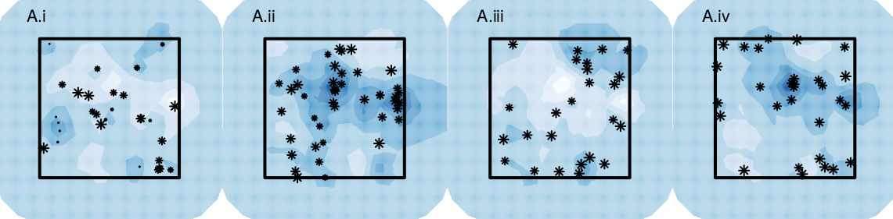
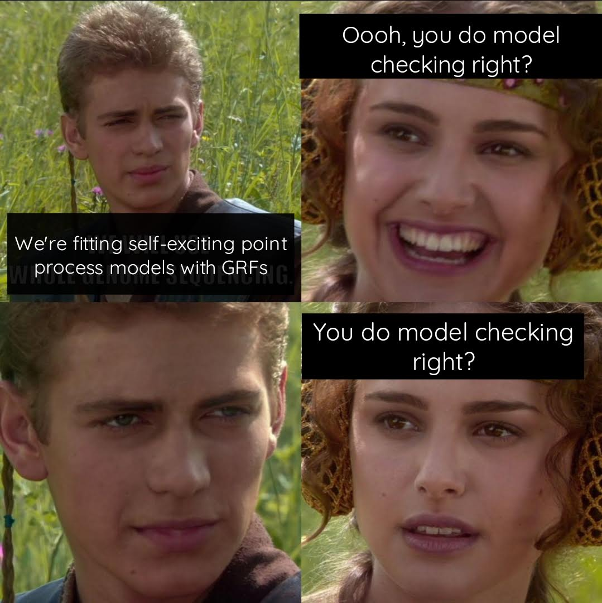

### But what about the unknown...

```{r ppr,fig.width=15,fig.height=5}
library(spatstat)
set.seed(4321)
locs <- cbind(runif(100),runif(100))
pp <- ppp(locs[,1], locs[,2])
win <- owin()
par(mfrow = c(1,3), mar = c(0,0,0,0))
## point pattern
plot(locs,axes = "F",pch = 20,xlab = "",ylab = "",xlim = c(0,1),ylim = c(0,1),col = "darkgrey")
plot(win,add = TRUE)
## quadrat count
plot(locs,axes = "F",pch = 20,xlab = "",ylab = "",xlim = c(0,1),ylim = c(0,1),col = "darkgrey")
plot(win,add = TRUE)
q <- quadratcount(pp,5,5)
plot(q,add = TRUE,cex = 1.5)
## quad count finer matrix
plot(locs,axes = "F",pch = 20,xlab = "",ylab = "",xlim = c(0,1),ylim = c(0,1),col = "darkgrey")
plot(win,add = TRUE)
q <- quadratcount(pp,10,10)
plot(q,add = TRUE,cex = 1.5)
```


---
### Random fields!

```{r rfs, fig.width=15,fig.height=5, fig.align='center'}
library(spatstat)
spatstat.options(npixel=300)
sigma2x <- c(1,1,3)
kappax <- c(2,3,10)
rangex <- sqrt(8*1)/kappax
beta0 <- 3
library(RandomFields)
set.seed(5432)
fields <- points <- list()
for (i in 1:3){
    lg.s <- rLGCP('matern', beta0,
                  var=sigma2x[i], scale=1/kappax[i], nu=1)
    ## points
    points[[i]] <- cbind(lg.s$x, lg.s$y)[,2:1]
    ## exponential of LGRF
    Lam <- attr(lg.s, 'Lambda')
    fields[[i]] <- log(Lam$v)
}
layout(matrix(c(0,1,2,3,4,
                0,0,0,0),nrow = 2,byrow = TRUE),respect = TRUE,
       widths = c(0.4,3,3,3,3),
       heights = c(3,0.2))

par(mar = c(0,0,0,0),xpd = TRUE,oma = c(0,0,0,0))
x <- seq(1,5, length.out = 100)
plot(x, rSPDE::matern.covariance(x, kappa = kappax[1], nu = 1, sigma = sqrt(sigma2x[1])),
     type = "l", ylab ="", xlab = "",lwd = 2,xaxt = "n")
mtext(line = 0.5, side = 1, "Distances between points")
mtext(line = 2,side = 2, expression(C[z]))
lines(x,rSPDE::matern.covariance(x, kappa = kappax[2], nu = 1, sigma = sqrt(sigma2x[2])), lty = 2,lwd = 2)
lines(x,rSPDE::matern.covariance(x, kappa = kappax[3], nu = 1, sigma = sqrt(sigma2x[3])), lty = 3,lwd = 2)
legend("topright",bty = "n", lty = 1:3,lwd = 2, legend = c("i)","ii)", "iii)"),cex = 2)
## fields
image(fields[[1]],axes = FALSE,  col = RColorBrewer::brewer.pal(9, "Blues"),asp = 1)
points(points[[1]],pch = 20)
legend(-0.05,0.1,bty = "n", cex = 2,legend = "i)")
box()
image(fields[[2]],axes = FALSE,  col = RColorBrewer::brewer.pal(9, "Blues"), asp = 1)
points(points[[2]],pch = 20)
legend(-0.05,0.1,bty = "n", cex = 2,legend = "ii)")
box()
image(fields[[3]],axes = FALSE,  col = RColorBrewer::brewer.pal(9, "Blues"),asp = 1)
points(points[[3]],pch = 20)
legend(-0.05,0.1,bty = "n", cex = 2,legend = "iii)")
box()
```


---

### `r emo::ji("knife")` Cutting up space 

### INLA & TMB...

```{r echo=FALSE, out.height='100%'}
knitr::include_graphics("img/lgcp-fit.png")
```


---


### LGCP: the maths

<br>

Intensity surface $\rightarrow$ $\{\Lambda(x): x \in {\rm I\!R}^{k+1}\}$ .small[for *k*D space and 1D time]
 <br>
 <br>
 <br>

Overall spatiotemporal intensity 
$\mu = \int_{{\rm I\!R^{k+1}}} \Lambda(x)dx$ where $\Lambda(x) = \textrm{exp}(\bf{X}\beta + Z(x))$
<br>
 <br>

For Gaussian random field, $Z(x)$, with mean $\boldsymbol{\mu}$, variance-covariance matrix $\boldsymbol{Q}^{-1}$

---
### LGCP: AR(1) through time

<br>
 <br>
.center[

]

---
### Self-excitement

#### `r fontawesome::fa("question-circle")` vote in the chat

.center[

]


---
### Self-excitement

.center[

]


---
### Self-excitement: the maths
<br>
<br>
<br>
Points are conditional to the history of the process $H_t$

<br>

$$\lambda(\textbf{s},t|H_t) = \mu(\textbf{s}) + \Sigma_{i:t_i<t}g(s - s_i,t - t_i).$$

--

<br>
<br>

$$\textrm{log}(l(\boldsymbol{\theta})) = \int_{t, \textbf{s}} \mu(\textbf{s}) + \sum_{i = 1}^n \textrm{log}(\lambda(s_i, t_i)) - \int_{t, \textbf{s}} \sum_{i: t_i < t} g(s - s_i, t - t_i)$$
---
### `r emo::ji("witch")` Sorting hats

.center[]

---
### Self-excitement

```{r echo=FALSE, out.width='70%'}
knitr::include_graphics("img/hawkes_spat.png")
```


---

.center[

]
---

### Diolch am wrando 

```{r, eval = FALSE, echo = FALSE}
## linux <sudo apt-get install cowsay>
```

.pull-left[
.animate__animated.animate__bounceInDown[
```{r dragon, echo = FALSE,eval = TRUE, comment = ""}
system2("cowsay", args = "-f dragon 'Questions?'", stdout = TRUE)
```
]
]


.pull-right[
<br>
.center[`r fontawesome::fa("question-circle")` leopard seal scat]
<br>
<br>
.center[`r fontawesome::fa("twitter")` @cmjonestodd]
<br>
.center[`r fontawesome::fa("github")` @cmjt]
<br>
.center[`r fontawesome::fa("image")` [cmjt.github.io/slides/latent](https://cmjt.github.io/slides/latent)]
]


