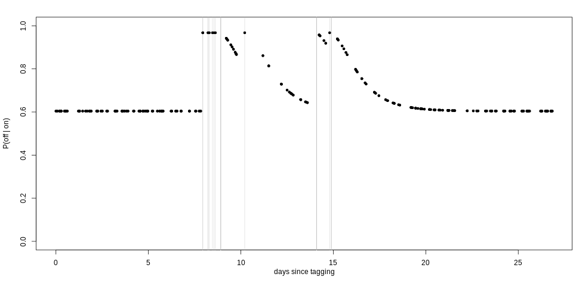

```{r setup, include=FALSE}
knitr::opts_chunk$set(echo = FALSE)
options(htmltools.dir.version = FALSE)
## remotes::install_github("gadenbuie/xaringanExtra")
xaringanExtra::use_panelset()
## devtools::install_github("EvaMaeRey/flipbookr")
library(flipbookr)
options(warn = -1)
```


```{r xaringan-themer, include=FALSE, warning=FALSE}
library(xaringanthemer)

style_mono_accent(
  base_color = "#1c5253",
  header_font_google = google_font("Lora", "Yanone Kaffeesatz"),
  text_font_google   = google_font("Montserrat", "300", "300i"),
  code_font_google   = google_font("Fira Mono")
)
```


### `r anicon::faa("graduation-cap", animate="pulse")` On paper

<br>
<br>

 *Prifysgol Aberystwyth* BSc (Hons) in Mathematics

<br>


 *University of St Andrews* MSc in Statistics

<br>


  *University of St Andrews* PhD in Statistics


---

background-image: url("img/animals.png")
background-size: fill

### IRL


---

## *Cats* to *Stats*

<br>
<br>

 *Veterinary nurse/assistant/receptionist* John Downes Surgery, 2009–2013

<br>

 *Statistician* National Institute of Water and Atmospheric Research (NIWA), 2018–2019

<br>

  *Lecturer/Senior Lecturer* University of Auckland, 2019–present

---

## Why maths/stats?

--

.center[

]

---
<<<<<<< HEAD
class: inverse

.center[
## A brief foray back into the *real world*
]

---
=======
>>>>>>> 86c368a1ff958839c7027e16929b633d31890b35

## NIWA


> Crown Research Institutes (CRIs) are crown-owned companies that carry out scientific research for the benefit of New Zealand.

.center[

]

---

## NIWA


.pull-left[
**Colleagues**

]

--

.pull-right[
**Me**

]


---

<<<<<<< HEAD
## `r fontawesome::fa("question-circle")` Back to academia


=======
## `r fontawesome::fa("question-circle")` Academia
>>>>>>> 86c368a1ff958839c7027e16929b633d31890b35

.center[

]

```{r, echo = FALSE, message=FALSE, warning=FALSE, fig.align='center', eval = FALSE}
require(tidyverse)

data.frame(per = c(1,0,0,
									 0.8,0.1,0.1, 
									 0.6, 0.2, 0.2,
									 0.4, 0.4, 0.2,
									 0.4, 0.3, 0.3,
									 1/3, 1/3, 1/3	),
					 group = rep(c("Research", "Teaching", "Service"), times = 6),
					 options = rep(1:6, each = 3)) %>%
	 mutate(type = fct_relevel(group, "Research", "Teaching", "Service")) %>%
	group_by(type) %>%
  mutate(label_y = per) %>%
	ggplot(aes(x = options, y = per, fill = type)) + geom_col() + scale_fill_brewer(palette = "Dark2") +
	theme_void() + labs(fill = "") + annotate("text",label = c("100:0:0","80:10:10",
																													 "60:20:20", "40:40:20",
																													 "40:30:30", "1/3:1/3:1/3"),
																								 y = 1, x = 1:6, vjust = -0.5) 
```

---
class: inverse

.center[
# Research

]

---

```{r, eval = FALSE, echo = FALSE}
namedropR::drop_name_crossref("10.1371/journal.pone.0290819", use_xaringan = TRUE, style = "newspaper",qr_size = 150, author_size = "8pt", title_size = "12pt", journal_size = "10pt", max_authors = 1)
```

<br>
<br>


`r htmltools::includeHTML("visual_citations/Jones‐Todd_2017.html")`

`r htmltools::includeHTML("visual_citations/Jones-Todd_2018.html")`

`r htmltools::includeHTML("visual_citations/Jones‐Todd_2021.html")`

---

<br>
<br>

`r htmltools::includeHTML("visual_citations/Python_2018.html")`

`r htmltools::includeHTML("visual_citations/Soriano‐Redondo_2019.html")`

`r htmltools::includeHTML("visual_citations/Hin_2023.html")`

---

`r htmltools::includeHTML("visual_citations/Jones-Todd_2018.html")`

.panelset[
 .panel[.panel-name[Pretty plot]
.center[
```{r, fig.align='center', out.width="100%"}
knitr::include_graphics("img/cancer_im.png")
```
]
]
 .panel[.panel-name[Maths]
 .center[
```{r, echo=FALSE, out.width="40%"}
knitr::include_graphics("https://pbs.twimg.com/media/DuKns0KX4AAvApq?format=jpg&name=small")
```
]
]
.panel[.panel-name[More Maths]
.center[
```{r, fig.align='center', out.width="80%"}
knitr::include_graphics("img/cancer_nn.png")
```
]
]
]


---

### `r anicon::faa("hand-spock", animate="pulse")` if you use a running App


--

.center[
```{r run,eval = TRUE, echo = FALSE,out.height=500}

```
]

---


`r htmltools::includeHTML("visual_citations/Jones‐Todd_2021.html")`

.center[

.footnote[`r icon::fa_camera()` Charlotte Dunn]
]


---

<<<<<<< HEAD

.pull-left[
## The data

]
.pull-right[

]


---

=======
>>>>>>> 86c368a1ff958839c7027e16929b633d31890b35
### Continuous-time correlated random walk model (CTCRW) 

For each coordinate $c = 1,2$ of the observed location of an animal at time $t$ ( $t = 1,2,...,n$ ):

<br>

--
 - instantaneous velocity of the animal $v_{ct}$ is described by a Ornstein-Uhlenbeck process;
 

--
<br>
 - integrating over the velocity process gives the location process $\mu_{ct}$;

--

<br>
 - measurement equation is given by $y_{ct} = \mu_{ct} + \epsilon_{ct}$, where $y_{ct}$ is the $c$th coordinate of the observed location of an animal at time $t$ with measurement error term $\epsilon_{ct}$. The joint distribution of $\epsilon_{1t}$ and $\epsilon_{2t}$ is a bivariate $t$-distribution. 


---

### Continuous-time correlated random walk model (CTCRW) 

.center[
```{r track,eval = TRUE, echo = FALSE,out.height=500}
knitr::include_graphics("img/track_example.png")
```
]


---

### Discrete-space continuous-time

A continuous-time Markov model describes how an individual transitions between states in continuous time.
.center[
```{r markov,echo = FALSE,out.width=600}
par(mar=c(0,0,0,0))
plot(1, type = "n",xlab = "",ylab = "",axes = FALSE, xlim = c(0,1),ylim = c(0,1),asp  = 1)
plotrix::draw.circle(0.25,0.5,0.1)
plotrix::draw.circle(0.75,0.5,0.1)
diagram::curvedarrow(c(0.25,0.4),c(0.75,0.4),curve = 0.1)
diagram::curvedarrow(c(0.75,0.6),c(0.25,0.6),curve = 0.1)
diagram::curvedarrow(c(0.75,0.4),c(0.75,0.6))
diagram::curvedarrow(c(0.25,0.4),c(0.25,0.6),curve = -1)
text(0.25,0.5,"state 1")
text(0.75,0.5,"state 2")
```
]


---

### Discrete-space continuous-time


<br>

Let $q_{rs}(t,z(t))$ represent the immediate risk of moving from one state $r$ to another state $s$:

<br>
$$q_{rs}(t,z(t)) = \text{lim}_{\delta t \rightarrow 0} \mathbb{P}(S(t + \delta t) = s|S(t) = r)/\delta t.$$
<br>

These transition rates form a square matrix $\bf{Q}$ with elements $q_{rs}$.

--

<br>

Here $q_{rr}=-\Sigma_{s{\neq}r}q_{rs}$ (i.e., the rows of **Q** sum to zero and $q_{rs}\geq0$ for $r{\neq}s$).

---

### Discrete-space continuous-time 

<br>

We have $r, s = \{1,2\}$ where state $1=$ off-range (i.e., outside the area used by the Navy for military operations) and state $2=$ on-range:

<br>
<br>

$$\begin{array}{ccc}
  \bf{Q} =
  \left [\begin{array}{cc}
    q_{1 1} & q_{1 2} \\
      q_{2 1} & q_{2 2}
    \end{array}\right ] & \text{where} \: q_{r r} = -q_{r s}, & \text{for}\: r \neq s.
  \end{array}$$

---
  
### Including exposure information


We let 

<br>

$$\text{log}(q_{k, rs}(\mathbf{z}_k(t))) = (\beta_{0,rs} + u_{k, rs}) + \beta_{1,rs}\text{exp}(- \beta_{2,rs} \mathbf{z}_k(t)),$$

where


$$\mathbf{z}_k(t)  \left\{ \begin{array}{rl} = 0 & \text{during exposure} \\ \geq 0 & \text{otherwise}\end{array} \right.$$


is the number of days since an individual was exposed to a sonar event and $\beta_{2,rs} \geq 0$ $\forall\: r \neq s$.

---

### Including exposure information


We let 

<br>

$$\text{log}(q_{k, rs}(\mathbf{z}_k(t))) = (\color{red}{\beta_{0,rs}} + u_{k, rs}) + \beta_{1,rs}\text{exp}(- \beta_{2,rs} \mathbf{z}_k(t)),$$


where


$$\mathbf{z}_k(t)  \left\{ \begin{array}{rl} = 0 & \text{during exposure} \\ \geq 0 & \text{otherwise}\end{array} \right.$$

is the number of days since an individual was exposed to a sonar event and $\beta_{2,rs} \geq 0$ $\forall\: r \neq s$.

<br>

.red[some baseline transition rate]

---

### Including exposure information


We let 

<br>

$$\text{log}(q_{k, rs}(\mathbf{z}_k(t))) = (\beta_{0,rs} + u_{k, rs}) + \color{red}{\beta_{1,rs}}\text{exp}(- \beta_{2,rs} \mathbf{z}_k(t)),$$


where


$$\mathbf{z}_k(t)  \left\{ \begin{array}{rl} = 0 & \text{during exposure} \\ \geq 0 & \text{otherwise}\end{array} \right.$$

is the number of days since an individual was exposed to a sonar event and $\beta_{2,rs} \geq 0$ $\forall\: r \neq s$.

<br>

.red[change in transition rate during exposure]

---

### Including exposure information


We let 

<br>

$$\text{log}(q_{k, rs}(\mathbf{z}_k(t))) = (\beta_{0,rs} + u_{k, rs}) + \beta_{1,rs}\text{exp}(\color{red}{- \beta_{2,rs}} \mathbf{z}_k(t)),$$


where


$$\mathbf{z}_k(t)  \left\{ \begin{array}{rl} = 0 & \text{during exposure} \\ \geq 0 & \text{otherwise}\end{array} \right.$$

is the number of days since an individual was exposed to a sonar event and $\beta_{2,rs} \geq 0$ $\forall\: r \neq s$.

<br>

.red[exponential decay of transition rates towards some baseline]

---

### Including exposure information


We let 

<br>

$$\text{log}(q_{k, rs}(\mathbf{z}_k(t))) = (\beta_{0,rs} + \color{red}{u_{k, rs}}) + \beta_{1,rs}\text{exp}(- \beta_{2,rs} \mathbf{z}_k(t)),$$


where

$$\mathbf{z}_k(t)  \left\{ \begin{array}{rl} = 0 & \text{during exposure} \\ \geq 0 & \text{otherwise}\end{array} \right.$$


is the number of days since an individual was exposed to a sonar event and $\beta_{2,rs} \geq 0$ $\forall\: r \neq s$.

<br>

.red[individual level random effect]


---

**Results**

.center[
```{r results,eval = TRUE, echo = FALSE,out.height=600,out.width=600}
knitr::include_graphics("img/autec_results.png")
```
]

---
**Results**

.panelset[
.panel[.panel-name[93232]
.center[
<br>
<br>
```{r, echo = FALSE,fig.height = 3,out.width = "80%"}
knitr::include_graphics("img/whale1.png")
```
]
]
.panel[.panel-name[11164]
.center[
<br>
<br>
```{r, echo = FALSE,fig.height = 3,out.width = "80%"}
knitr::include_graphics("img/whale2.png")
```
]
]
.panel[.panel-name[111670]
.center[
<br>
<br>
```{r, echo = FALSE,fig.height = 3,out.width = "80%"}

```
]
]
.panel[.panel-name[129715]
.center[
<br>
<br>
```{r, echo = FALSE,fig.height = 3,out.width = "80%"}
knitr::include_graphics("img/whale4.png")
```
]
]
.panel[.panel-name[129719]
.center[
<br>
<br>
```{r, echo = FALSE,fig.height = 3,out.width = "80%"}
knitr::include_graphics("img/whale5.png")
```
]
]
.panel[.panel-name[129720]
.center[
<br>
<br>
```{r, echo = FALSE,fig.height = 3,out.width = "80%"}
knitr::include_graphics("img/whale6.png")
```
]
]
.panel[.panel-name[129721]
.center[
<br>
<br>
```{r, echo = FALSE,fig.height = 3,out.width = "80%"}
knitr::include_graphics("img/whale7.png")
```
]
]
]


---

### Current research

`r htmltools::includeHTML("visual_citations/stelfi.html")`

.center[

]

---

### `r fontawesome::fa("question-circle")` 

.center[

]


---


### A self-exciting point process (Hawkes model)

<br>
<br>


$$\lambda(t) = \color{red} \mu + \color{blue} \alpha \Sigma_{i:\tau_i<t}\text{exp}(-\color{green}\beta * (t-\tau_i))$$ 

 - $\color{red} \mu$, background rate
 - $\color{blue} \alpha$, increase in intensity after an event
 - $\color{green}\beta$, exponential decay
 - $\Sigma_{i:\tau_i<t} \cdots$, historic dependence
 - $\frac{\color{blue} \alpha}{\color{green}\beta}$, branching ratio (average number events triggered by an event)
 - $\frac{1}{\color{green}\beta}$, rate of decay of self-excitement
 
.center[

]

---

### Temporal rate of retweets 


.center[

]

---

### Temporal rate of retweets 

<br>
<br>
<br>

$$\lambda(t) = \color{red} \mu + \color{blue} \alpha \Sigma_{i:\tau_i<t}\text{exp}(-\color{green}\beta * (t-\tau_i))$$ 

 +  $n = 4890$ retweets over $\text{T} = 3143$ mins (~2 days)

 + $\color{red} {\hat{\mu}} \text{T} = 0.063 \times 3143 \sim 198$ 'baseline' tweets

 + Expected number of retweets triggered by any one tweet $\frac{\color{blue}{\hat{\alpha}}}{\color{green}{\hat{\beta}}} \sim 0.94$
 
 + Rate of decay for the self-excitement $\frac{1}{\color{green}{\hat{\beta}}} = \frac{1}{0.079} \sim 12$ mins
 
---

### Extension: a marked model

Here, the conditional intensity for the $j^{th}$ ( $j = 1, ..., N$ ) stream is given by

$$\lambda(t)^{j*} = \mu_j + \Sigma_{k = 1}^N\Sigma_{i:\tau_i<t} \alpha_{jk} e^{(-\beta_j * (t-\tau_i))},$$ 

where $j, k  \in (1, ..., N)$. Here, $\alpha_{jk}$ is the excitement caused by the $k^{th}$ stream on the $j^{th}$.

.center[

]

---
class: inverse

.center[
# Teaching


]


---


.panelset[
 .panel[.panel-name[Illustrations]
.center[

]
]

.panel[.panel-name[Mini Games]

.center[
`r icon::fa_desktop()` [statbiscuit.github.io/mini_games/](https://statbiscuit.github.io/mini_games/)
<iframe src="https://statbiscuit.github.io/mini_games/" width="900"  height="400"></iframe>
]
]

.panel[.panel-name[Virtual experiments]

.center[
`r icon::fa_desktop()` [cmjt.shinyapps.io/vested/](https://cmjt.shinyapps.io/vested/)
<iframe src="https://cmjt.shinyapps.io/vested/" width="900"  height="400"></iframe>
]
]
]

---
class:inverse

# Service


 + Manuscript reviewing
 + Seminar organisation
 + Committee membership
 + Faculty-level commitments
 + ...

---
class:inverse

# Charlotte's advice for life...


> It's *mainly* about who you grab a drink with (at morning tea or the pub)

.center[

]

---


#  


**Many of you who are not studying statistics may find yourself in a role with some stats responsibilities.**


- Free for students
- Early Career section with meetups/activities
- Mentoring program

---


#  


.center[
`r icon::fa_desktop()` [stats.org.nz](https://www.stats.org.nz)
<iframe src="https://www.stats.org.nz/nzsa-student-early-career-statisticians-network-secs/" width="900"  height="400"></iframe>
]


---

### [`r anicon::faa("laptop", animate="float")` cmjt.github.io](https://cmjt.github.io/)

```{r, eval = FALSE, echo = FALSE}
## linux <sudo apt-get install cowsay>
## devtools::install_github('emitanaka/anicon')
```

.pull-left[
.animate__animated.animate__bounceInDown[
```{r dragon, echo = FALSE,eval = TRUE, comment = ""}
system2("cowsay", args = "-f dragon 'Diolch am wrando'", stdout = TRUE)
```
]
]


