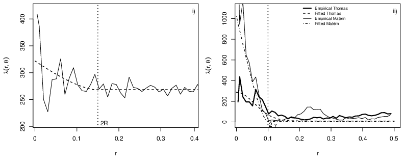
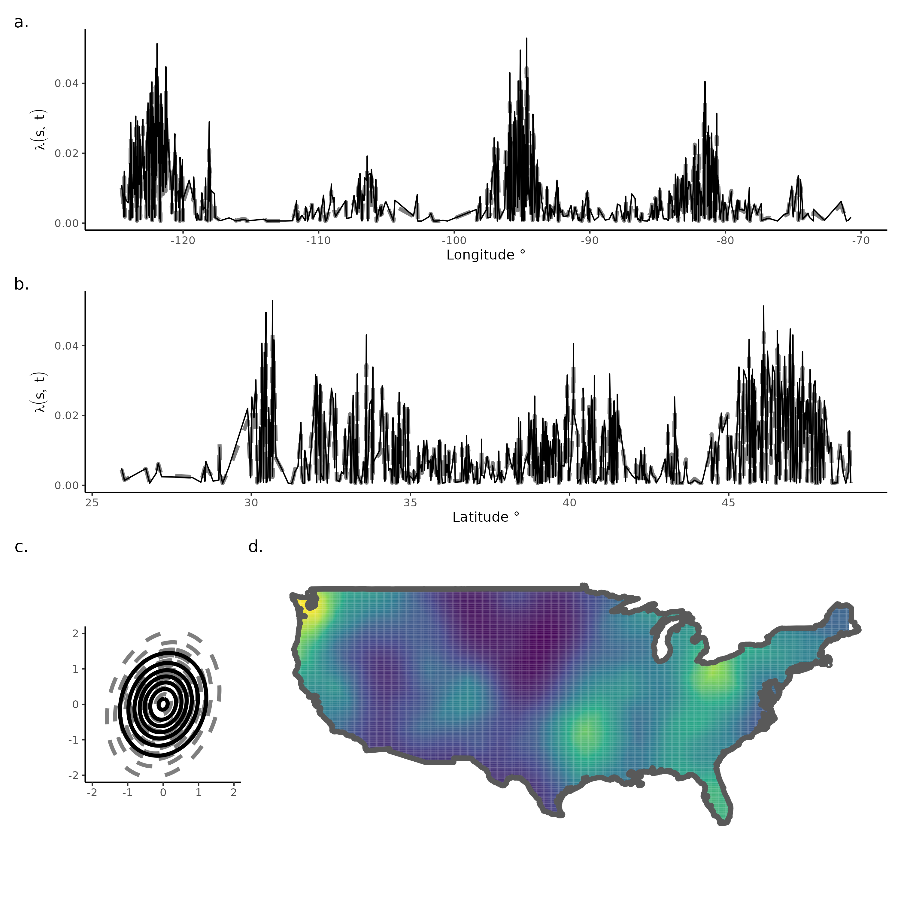

# Stroma and tumour cells...

```{r, echo = FALSE, eval = FALSE}
namedropR::drop_name_crossref("10.1002/sim.8046", use_xaringan = TRUE, style = "newspaper",qr_size = 150, author_size = "8pt", title_size = "12pt", journal_size = "10pt", max_authors = 1)
```

`r htmltools::includeHTML("visual_citations/Jones-Todd_2018.html")`


.center[
```{r, fig.align='center', out.width="100%"}
knitr::include_graphics("img/cancer_im.png")
```
]

---
# The data


<br>
<br>
<br>


+ 42 patients diagnosed with CRC

+ At follow up, 19 had died and the remaining were alive

+ Severity of the cancerous tissue graded by a pathologist as 
   + Dukes A (least severe, all alive at follow up), 
   + Dukes B ( $\sim$ 50% alive at follow up), or 
   + Dukes C (most severe, all dead at follow up). 
   


---

# Summarising the structure


<br>
<br>
<br>
.center[
```{r, fig.align='center', out.width="100%"}
knitr::include_graphics("img/cancer_pp.png")
```
]

---

# `r emo::ji("palm_tree")` The palm likelihood approach

 + The Palm intensity is a function of distance $r$, characterised by the parameter vector $\theta$: $\lambda(r; \theta)$

 + It describes how the point density varies as a function of distance $r$ from an arbitrarily chosen point. 
  
 + It returns the expected intensity of a point process at a distance $r$ from an arbitrarily chosen point. 


--

.center[
```{r, fig.align='center', out.width="80%"}

```
]


---

# Results( $\thickapprox$ )


<br>
<br>
<br>
<br>

+ **Stroma cells** `r fontawesome::fa("check", fill = "green")`
  + Smaller clusters in patients that died
  + Fewer voids in patients that died
  

+ **Tumour cells** `r fontawesome::fa("xmark", fill = "red")`
  + Fewer clusters in patients that died


---
# `r fontawesome::fa("magnifying-glass")` What about the unknown...

--

## Random fields!

<br>
<br>

```{r rfs, out.width="90%", fig.align='center'}
knitr::include_graphics("img/rfs_cov.png")
```

---


# log-Gaussian Cox process: the maths

<br>

Intensity surface $\rightarrow$ $\{\Lambda(x): x \in {\rm I\!R}^{k+1}\}$ .small[for *k*D space and 1D time]
 <br>
 <br>
 <br>

Overall spatiotemporal intensity 
$$\lambda(x) = \int_{{\rm I\!R^{k+1}}} \Lambda(x)dx$$ 
where $$\Lambda(x) = \textrm{exp}(\bf{X}\beta + Z(x) + \epsilon)$$ 

for Gaussian random field, $Z(x)$, with mean $\boldsymbol{\mu}$, variance-covariance matrix $\boldsymbol{Q}^{-1}$


---
# `r fontawesome::fa("box")` Can I gift wrap that for you? 

 <br>
 <br>


---
# Voronoi and Delaunay

 <br>

```{r, echo=FALSE,  out.width="100%"}

```


---
class: inverse, center, middle

# Is there more?

---

# Joint likelihood(s)

<br>
<br>

$$\begin{aligned}
    \Lambda(s) = \text{exp}(\boldsymbol{X}\boldsymbol{\beta} + G(\boldsymbol{x}) + \epsilon) \\
    M_j(s) = f^{-1}((\boldsymbol{X}\boldsymbol{\beta})_{m_j} + G_{m_j}(\boldsymbol{x}) + \alpha_{m_j}\; G(\boldsymbol{x}) + \epsilon_{m_j})
  \end{aligned}$$
  
<br>
<br>
  
The $\alpha_{m_j}$ are coefficient(s) linking the point process and the $\text{n}_\text{mark}$ mark(s), $m_j$ $(j = 1, ..., \text{n}_\text{mark})$, and the form of $M_j(s)$ and $f^{-1}()$ depends on the assumed distribution of the marks.


---
# Multiple (shared) random fields in a multispecies model


```{r, eval = FALSE, echo = FALSE}
namedropR::drop_name_crossref("10.1111/rssc.12250", use_xaringan = TRUE, style = "newspaper",qr_size = 150, author_size = "8pt", title_size = "12pt", journal_size = "10pt", max_authors = 1)
```

`r htmltools::includeHTML("visual_citations/Jones‐Todd_2017.html")`


Let $z_{ik}$ be a binary indicator of the $k^{th}$ species' presence ( $k = 1,2,3 =$ sparrowhawk, collared dove, house sparrow) at site $i$. Then $z_{ik} \sim \text{Bernoulli}(p_{ik})$, where $p_{ik}$ is the probability of presence of the $k^{th}$ species at site $i$. Letting $d_{ik}$ be the density of the $k^{th}$ species at location $i$, then $d_{ik}$ is given by, 

$$d_{ik} = \left\{\begin{array}{ll} \text{Gamma}(a_{ik},b_{ik})  &\text{with probability}\; p_{ik}\\
 0,  & \textrm{otherwise,} \end{array}\right.$$
 
with shape and scale parameters $(a_{ik},b_{ik})$ respectively, so that $E[d_{k}] = a_k\,b_k =  \mu_k$.


---
# Multiple (shared) random fields in a multispecies model

`r htmltools::includeHTML("visual_citations/Jones‐Todd_2017.html")`

The joint model is given by,

$$\begin{aligned}
\text{sparrowhawk} &\left\{ 
  \begin{array}{l}
    \text{logit}(p_{i1}) =   \mathbf{x_1}(\mathbf{s}_i,t)  \\ 
    \text{log}(\mu_{i1}) = \beta_{1} \mathbf{x_1}(\mathbf{s}_i,t), \\
    \end{array}
  \right.\\
  \text{collared dove} &\left\{
  \begin{array}{l}
    \text{logit}(p_{i2}) =  \mathbf{x_2}(\mathbf{s}_i,t)  \\ 
    \text{log}(\mu_{i2}) =  \beta_{2} \mathbf{x_2}(\mathbf{s}_i,t), \\
    \end{array}
  \right.\\
  \text{house sparrow} &\left\{
  \begin{array}{l}
    \text{logit}(p_{i3}) = \alpha +  \gamma_{1} \mathbf{x_1}(\mathbf{s}_i,t) + \gamma_{2} \mathbf{x_2}(\mathbf{s}_i,t) + \mathbf{x_3}(\mathbf{s}_i,t) \\
\text{log}(\mu_{i3}) = \alpha_{y} + \gamma_{3} \mathbf{x_1}(\mathbf{s}_i,t) + \gamma_{4} \mathbf{x_2}(\mathbf{s}_i,t) + \beta_3\mathbf{x_3}(\mathbf{s}_i,t).\\ 
    \end{array}
  \right.\\ 
\end{aligned}$$


Each $\mathbf{x_j}(\mathbf{s}_i,t),\: (j=1,2,3)$ is a spatio-temporal random effect modelled by a SPDE model 
 
---

# Results( $\thickapprox$ )

<br>
<br>
<br>

+ **Collared doves** `r fontawesome::fa("heart", fill = "green")`
  + areas of high occurrence related to areas of high house sparrow occurrence and abundance
  

+ **Sparrowhawks** `r fontawesome::fa("face-angry", fill = "red")`
  + areas of high occurrence related to areas of low house sparrow occurrence and abundance


---
class: inverse, center, middle

# Is there more?

---


# `r fontawesome::fa("question-circle")` 

.footnote[.tiny[First to yell out the correct answer gets my permission to skip the queue @ morning tea]]

<video width="500" height="20"  controls>
  <source src="img/whoop.mp3" type="video/mp4">
</video>

--

.center[

]


---
# `r fontawesome::fa("circle-question")` Sasquatch/Bigfoot

.pull-left[
<br>
<br>
]

.pull-right[]


[](https://www.bfro.net/)

---

# Self-exciting point process models

```{r, eval = FALSE, echo = FALSE}
namedropR::drop_name("bib.bib", cite_key = "stelfi",use_xaringan = TRUE, style = "newspaper", qr_size = 150, author_size = "8pt", title_size = "12pt", journal_size = "10pt")
```

`r htmltools::includeHTML("visual_citations/stelfi.html")`
<br>
<br>

.center[

]

---
# Temporal Hawkes process

<br>
<br>

$$\lambda(t) = \mu + \alpha \Sigma_{i:\tau_i<t}\text{exp}(-\beta * (t-\tau_i)) + \epsilon$$
<br>
<br>

 +  $n = 972$ sightings over $\text{T} = 2188$ days

 + $\hat{\mu} \text{T} = 0.12 \times 2188 \sim 263$ baseline sightings

 + Expected number of sightings triggered by any one sighting $\frac{\hat{\alpha}}{\hat{\beta}} = \frac{0.06}{0.09} = \frac{2}{3}$. 

 + Expected number of descendants per sighting $\frac{\hat{\beta}}{\hat{\beta} - \hat{\alpha}} = \frac{0.09}{0.09 - 0.06} = 3$
 
 + Rate of decay for the self-excitement $\frac{1}{\hat{\beta}} = \frac{1}{0.09} \sim 11$ days.


---
# Spatiotemporal self-exciting process 

.center[

]


---

# `r anicon::faa("image", animate="flash")` cmjt.github.io/slides/nzsa_2022


`r htmltools::includeHTML("visual_citations/Jones-Todd_2018.html")`
 
`r htmltools::includeHTML("visual_citations/Jones‐Todd_2017.html")`

`r htmltools::includeHTML("visual_citations/stelfi.html")`


 

---

# Diolch am wrando 

```{r, eval = FALSE, echo = FALSE}
## linux <sudo apt-get install cowsay>
## devtools::install_github('emitanaka/anicon')
```

.pull-left[
.animate__animated.animate__bounceInDown[
```{r dragon, echo = FALSE,eval = TRUE, comment = ""}
system2("cowsay", args = "-f dragon 'Questions?'", stdout = TRUE)
```
]
]

.pull-right[
.center[

]
.center[

]
.center[[`r anicon::faa('twitter', animate='float', rtext='@cmjonestodd')`](https://twitter.com/cmjonestodd)]
<br>
.center[[`r anicon::faa("github", animate="float")` @cmjt](https://github.com/cmjt)]

]