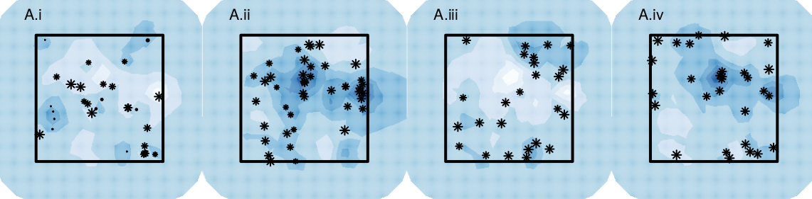
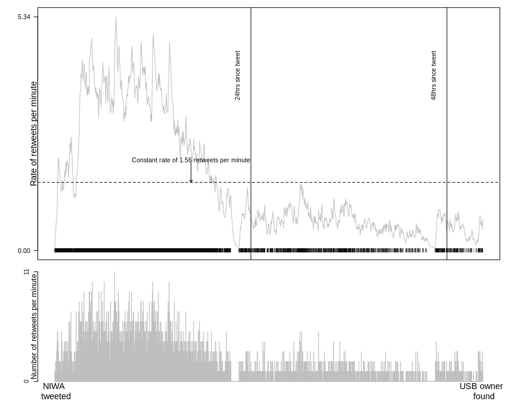
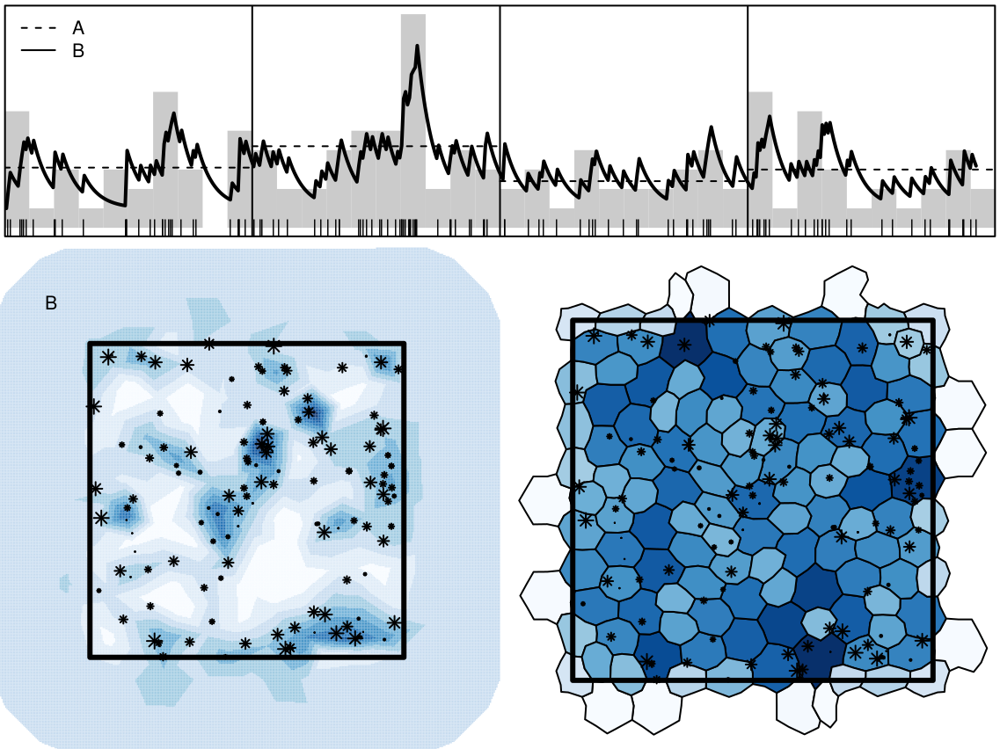
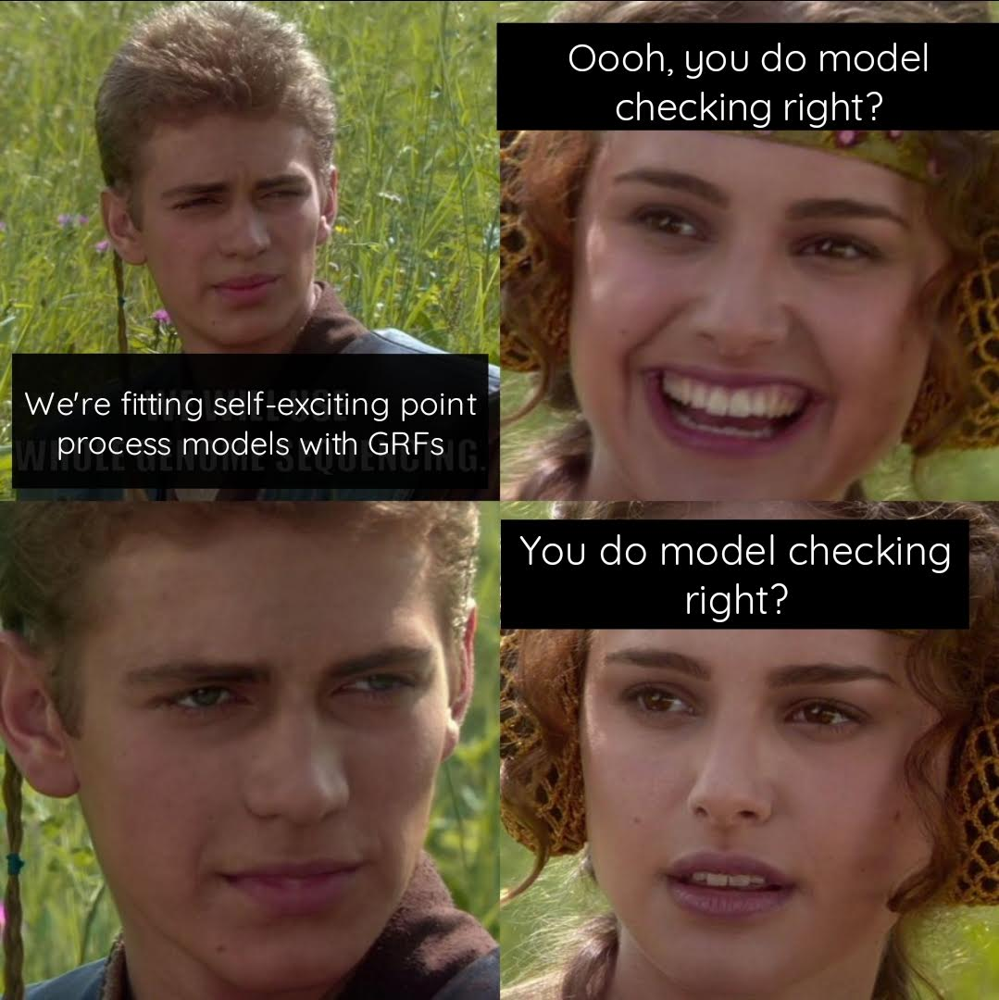

### Counting dots?


```{r pps,fig.width=15,fig.height=5}
library(spatstat)
set.seed(4321)
locs <- cbind(runif(100),runif(100))
pp <- ppp(locs[,1], locs[,2])
win <- owin()
par(mfrow = c(1,3), mar = c(0,0,0,0))
## point pattern
plot(locs,axes = "F",pch = 20,xlab = "",ylab = "",xlim = c(0,1),ylim = c(0,1),col = "darkgrey")
plot(win,add = TRUE)
## quadrat count
plot(locs,axes = "F",pch = 20,xlab = "",ylab = "",xlim = c(0,1),ylim = c(0,1),col = "darkgrey")
plot(win,add = TRUE)
q <- quadratcount(pp,5,5)
plot(q,add = TRUE,cex = 1.5)
## quad count finer matrix
plot(locs,axes = "F",pch = 20,xlab = "",ylab = "",xlim = c(0,1),ylim = c(0,1),col = "darkgrey")
plot(win,add = TRUE)
q <- quadratcount(pp,10,10)
plot(q,add = TRUE,cex = 1.5)
```

---

### Stroma and Tumour cells...

.center[
```{r, fig.align='center', out.width="100%"}
knitr::include_graphics("img/cancer_im.png")
```
]


---

### How would you summarize the structure? 

.center[
```{r, fig.align='center', out.width="100%"}
knitr::include_graphics("img/cancer_pp.png")
```
.pull-left[**Void process**] &nbsp;&nbsp; **Thomas process** .pull-right[**Matérn process**]
]

---

### `r emo::ji("palm_tree")` The Palm likelihood approach

 + The Palm intensity is a function of distance $r$, characterised by the parameter vector $\theta$: $\lambda(r; \theta)$

 + It describes how the point density varies as a function of distance $r$ from an arbitrarily chosen point. 
  
 + It returns the expected intensity of a point process at a distance $r$ from an arbitrarily chosen point. 
  
.center[
```{r, fig.align='center', out.width="80%"}
knitr::include_graphics("img/cancer_nn.png")
```
]

---
#### The Data
<br>
<br>
<br>

+ 42 patients diagnosed with CRC

+ At follow up, 19 had died and the remaining were alive

+ The severity of the cancerous tissue was graded by a pathologist as either Dukes A (least severe), Dukes B, or Dukes C (most severe). All patients graded Dukes A were alive at follow up and those graded Dukes C were all dead at follow up; the patients graded Dukes B consisted of a mixture (approximately 50%) of patients who died from CRC and were alive at follow up.

---

#### Results

+ **Void process**
  + Strong evidence to suggest that stroma daughter density in patients that died was lower than in
those that were alive at follow up. 
  + Weak evidence  to suggest that stroma parent density in patients that died was lower than in those that were alive at follow up. 
  
+ **Thomas process**
  + Strong evidence to suggest that stroma nuclei patterns of patients who died from CRC have on
average a lower number of daughters per parent,
  + Evidence to suggest that tumour parent density is lower in patient’s who died from CRC.
  
+ **Matérn process**
  + Strong evidence to suggest that stroma nuclei patterns of patients who died from CRC have on
average a lower number of daughters per parent.
  + Evidence to suggest that tumour parent density is lower in patient’s who died from CRC.


---
### But what about the unknown...

```{r ppr,fig.width=15,fig.height=5}
library(spatstat)
set.seed(4321)
locs <- cbind(runif(100),runif(100))
pp <- ppp(locs[,1], locs[,2])
win <- owin()
par(mfrow = c(1,3), mar = c(0,0,0,0))
## point pattern
plot(locs,axes = "F",pch = 20,xlab = "",ylab = "",xlim = c(0,1),ylim = c(0,1),col = "darkgrey")
plot(win,add = TRUE)
## quadrat count
plot(locs,axes = "F",pch = 20,xlab = "",ylab = "",xlim = c(0,1),ylim = c(0,1),col = "darkgrey")
plot(win,add = TRUE)
q <- quadratcount(pp,5,5)
plot(q,add = TRUE,cex = 1.5)
## quad count finer matrix
plot(locs,axes = "F",pch = 20,xlab = "",ylab = "",xlim = c(0,1),ylim = c(0,1),col = "darkgrey")
plot(win,add = TRUE)
q <- quadratcount(pp,10,10)
plot(q,add = TRUE,cex = 1.5)
```

---

### But what about the unknown...

```{r cont, fig.width = 8, fig.height=8}
image(density(pp)$v,axes = FALSE,col = cols)
points(locs,pch = 20)
```

---

### Random fields!

```{r rfs, fig.width=15,fig.height=5, fig.align='center'}
library(spatstat)
spatstat.options(npixel=300)
sigma2x <- c(1,1,3)
kappax <- c(2,3,10)
rangex <- sqrt(8*1)/kappax
beta0 <- 3
library(RandomFields)
set.seed(5432)
fields <- points <- list()
for (i in 1:3){
    lg.s <- rLGCP('matern', beta0,
                  var=sigma2x[i], scale=1/kappax[i], nu=1)
    ## points
    points[[i]] <- cbind(lg.s$x, lg.s$y)[,2:1]
    ## exponential of LGRF
    Lam <- attr(lg.s, 'Lambda')
    fields[[i]] <- log(Lam$v)
}
layout(matrix(c(0,1,2,3,4,
                0,0,0,0),nrow = 2,byrow = TRUE),respect = TRUE,
       widths = c(0.4,3,3,3,3),
       heights = c(3,0.2))

par(mar = c(0,0,0,0),xpd = TRUE,oma = c(0,0,0,0))
x <- seq(1,5, length.out = 100)
plot(x, rSPDE::matern.covariance(x, kappa = kappax[1], nu = 1, sigma = sqrt(sigma2x[1])),
     type = "l", ylab ="", xlab = "",lwd = 2,xaxt = "n")
mtext(line = 0.5, side = 1, "Distances between points")
mtext(line = 2,side = 2, expression(C[z]))
lines(x,rSPDE::matern.covariance(x, kappa = kappax[2], nu = 1, sigma = sqrt(sigma2x[2])), lty = 2,lwd = 2)
lines(x,rSPDE::matern.covariance(x, kappa = kappax[3], nu = 1, sigma = sqrt(sigma2x[3])), lty = 3,lwd = 2)
legend("topright",bty = "n", lty = 1:3,lwd = 2, legend = c("i)","ii)", "iii)"),cex = 2)
## fields
image(fields[[1]],axes = FALSE,  col = RColorBrewer::brewer.pal(9, "Blues"),asp = 1)
points(points[[1]],pch = 20)
legend(-0.05,0.1,bty = "n", cex = 2,legend = "i)")
box()
image(fields[[2]],axes = FALSE,  col = RColorBrewer::brewer.pal(9, "Blues"), asp = 1)
points(points[[2]],pch = 20)
legend(-0.05,0.1,,bty = "n", cex = 2,legend = "ii)")
box()
image(fields[[3]],axes = FALSE,  col = RColorBrewer::brewer.pal(9, "Blues"),asp = 1)
points(points[[3]],pch = 20)
legend(-0.05,0.1,,bty = "n", cex = 2,legend = "iii)")
box()
```

---
### `r emo::ji("bed")` Bed sheets?

.center[
```{r spde,fig.height=8,fig.width=8,fig.align='center'}
library(plotly)
n <- seq(-4,4,length.out = 10)
n <- rep(n, each = 10) 
z <- outer(X = n,Y = n,function(X,Y) sin(X)*cos(Y))
## smoother
n <- seq(-4,4,length.out = 100)
z2 <-  outer(X = n,Y = n,function(X,Y) sin(X)*cos(Y)) + 2

p <- plot_ly(showscale = FALSE) %>%
  add_surface(z = ~z, cmin = min(z), cmax = max(z), colorscale = list(c(0, 1), c("#F7FBFF", "#08306B"))) %>%
  add_surface(z = ~z2, cmin = min(z2), cmax = max(z2),colorscale = list(c(0, 1), c("#F7FBFF", "#08306B")), opacity = 0.98) %>%
layout(
    title = "",
    scene = list(
      xaxis = list(title = "",zeroline = FALSE,showline = FALSE,showticklabels = FALSE,showgrid= FALSE),
      yaxis = list(title = "",zeroline = FALSE,showline = FALSE,showticklabels = FALSE,showgrid= FALSE),
      zaxis = list(title = "",zeroline = FALSE,showline = FALSE,showticklabels = FALSE,showgrid= FALSE)
    )) %>% config(displayModeBar = FALSE)
p
```
]

.footnote[[Lindgren, F., Rue, H., and Lindström, J. (2011). An explicit link between Gaussian fields and
Gaussian Markov random fields: the stochastic partial differential equation approach. Journal
of the Royal Statistical Society: Series B (Statistical Methodology), 73(4):423–498.](https://rss.onlinelibrary.wiley.com/doi/pdf/10.1111/j.1467-9868.2011.00777.x)]
---

### `r emo::ji("knife")` Cutting up space 

#### INLA & TMB...

.center[
```{r echo=FALSE, out.width='90%'}
knitr::include_graphics("img/lgcp-fit.png")
```
]


---


### LGCP: the maths

<br>

Intensity surface $\rightarrow$ $\{\Lambda(x): x \in {\rm I\!R}^{k+1}\}$ .small[for *k*D space and 1D time]
 <br>
 <br>
 <br>

Overall spatiotemporal intensity 
$\mu = \int_{{\rm I\!R^{k+1}}} \Lambda(x)dx$ where $\Lambda(x) = \textrm{exp}(\bf{X}\beta + Z(x))$
<br>
 <br>

For Gaussian random field, $Z(x)$, with mean $\boldsymbol{\mu}$, variance-covariance matrix $\boldsymbol{Q}^{-1}$

---
### LGCP: AR(1) through time

<br>
 <br>
.center[
```{r echo=FALSE, out.width='90%'}

```
]


---
class: inverse, center, middle

### What else can we do?

---
#### Multiple (shared) random fields in a multispecies model

Let $z_{ik}$ be a binary indicator of the $k^{th}$ species' presence ( $k = 1,2,3 =$ sparrowhawk, collared dove, house sparrow) at site $i$. Then $z_{ik} \sim \text{Bernoulli}(p_{ik})$, where $p_{ik}$ is the probability of presence of the $k^{th}$ species at site $i$. Letting $d_{ik}$ be the density of the $k^{th}$ species at location $i$, then $d_{ik}$ is given by, 

$$d_{ik} = \left\{\begin{array}{ll} \text{Gamma}(a_{ik},b_{ik})  &\text{with probability}\; p_{ik}\\
 0,  & \textrm{otherwise,} \end{array}\right.$$
 
with shape and scale parameters $(a_{ik},b_{ik})$ respectively, so that $E[d_{k}] = a_k\,b_k =  \mu_k$.

--
The joint model is given by,

$$\begin{aligned}
\text{sparrowhawk} &\left\{ 
  \begin{array}{l}
    \text{logit}(p_{i1}) =   \mathbf{x_1}(\mathbf{s}_i,t)  \\ 
    \text{log}(\mu_{i1}) = \beta_{1} \mathbf{x_1}(\mathbf{s}_i,t), \\
    \end{array}
  \right.\\
  \text{collared dove} &\left\{
  \begin{array}{l}
    \text{logit}(p_{i2}) =  \mathbf{x_2}(\mathbf{s}_i,t)  \\ 
    \text{log}(\mu_{i2}) =  \beta_{2} \mathbf{x_2}(\mathbf{s}_i,t), \\
    \end{array}
  \right.\\
  \text{house sparrow} &\left\{
  \begin{array}{l}
    \text{logit}(p_{i3}) = \alpha +  \gamma_{1} \mathbf{x_1}(\mathbf{s}_i,t) + \gamma_{2} \mathbf{x_2}(\mathbf{s}_i,t) + \mathbf{x_3}(\mathbf{s}_i,t) \\
\text{log}(\mu_{i3}) = \alpha_{y} + \gamma_{3} \mathbf{x_1}(\mathbf{s}_i,t) + \gamma_{4} \mathbf{x_2}(\mathbf{s}_i,t) + \beta_3\mathbf{x_3}(\mathbf{s}_i,t).\\ 
    \end{array}
  \right.\\ 
\end{aligned}$$


Each $\mathbf{x_j}(\mathbf{s}_i,t),\: (j=1,2,3)$ is a spatio-temporal random effect modelled by a SPDE model 
 
---

#### Multiple (shared) random fields in a multispecies model

<br>
<br>
<br>

+ The presence of collared doves positively related to both the presence and the density of house sparrows (i.e. areas of high collared dove occurrence relate to areas of high house sparrow occurrence and abundance) 


+ A negative relationship between the presence of sparrowhawks and house sparrows (i.e., the occurrence of sparrowhawks does not share the same spatial structure as either the occurrence or density of house sparrows).


---
class: inverse, center, middle

### Is there more?

---

### Self-excitement

#### `r fontawesome::fa("question-circle")` vote in the chat

.center[

]


---
### Self-excitement

.center[

]


---
### Self-excitement: the maths
<br>
<br>
<br>
Points are conditional to the history of the process $H_t$

<br>

$$\lambda(\textbf{s},t|H_t) = \mu(\textbf{s}) + \Sigma_{i:t_i<t}g(s - s_i,t - t_i).$$

--

<br>
<br>

$$\textrm{log}(l(\boldsymbol{\theta})) = \int_{t, \textbf{s}} \mu(\textbf{s}) + \sum_{i = 1}^n \textrm{log}(\lambda(s_i, t_i)) - \int_{t, \textbf{s}} \sum_{i: t_i < t} g(s - s_i, t - t_i)$$
---
### `r emo::ji("witch")` Sorting hats

.center[]

---
### Self-excitement

```{r echo=FALSE, out.width='70%'}

```

---

.center[

]


---
### Other work: Network distances

.center[]

---
### Other work: Network distances
.center[]


---

### References

 + [**Jones-Todd, C. M.**, Caie, P., Illian, J. B., Stevenson, B. C., Savage, A., Harrison D, J., & Bown, J. (2019) Identifying prognostic structural features in tissue sections of colon cancer patients using point pattern analysis. *Statistics in Medicine*, 38 (8), 1421–1441.](https://onlinelibrary.wiley.com/doi/pdf/10.1002/sim.8046)
 
 + [**Jones-Todd, C. M.**, Swallow, B., Illian, J. B., & Toms, M. (2018) A spatio-temporal multi-species model of a semi-continuous response. *Journal of the Royal Statistical Society, Series C (Applied Statistics)*, 67 (3), 705–722.](https://rss.onlinelibrary.wiley.com/doi/full/10.1111/rssc.12250)

 + [Soranio-Redondo, A., **Jones-Todd, C. M.**, Bearhop, S., Hilton, G. M., Lock, L., Stanbury, A., Votier, S. C., & Illian, J. B. (2019) Understanding species distribution in dynamic populations: a new approach using spatio-temporal point process models. *Ecography*, 42 (6), 1092–1102.](https://onlinelibrary.wiley.com/doi/pdf/10.1111/ecog.03771)
 
 + [Python, A.,  Illian, J. B., **Jones-Todd, C. M.**, & Blàngiardo, M. A Bayesian approach to modelling subnational spatial dynamics of worldwide non-state terrorism, 2010–2016. (2019) *Journal of the Royal Statistical Society, Series  A (Statistics in Society)*, 182 (1), 323–344.](https://rss.onlinelibrary.wiley.com/doi/pdfdirect/10.1111/rssa.12384)
 
 + **Jones-Todd, C. M.**, Pirotta, E., Durban, J., Claridge, D., Baird, R., Falcone, E., Schorr, G., Watwood,S., & Thomas, L.  *(In press)* Continuous-time discrete-space models of marine mammal exposure to Navy sonar.

---

### Diolch am wrando 

```{r, eval = FALSE, echo = FALSE}
## linux <sudo apt-get install cowsay>
```

.pull-left[
.animate__animated.animate__bounceInDown[
```{r dragon, echo = FALSE,eval = TRUE, comment = ""}
system2("cowsay", args = "-f dragon 'Questions?'", stdout = TRUE)
```
]
]


.pull-right[
<br>
.center[`r fontawesome::fa("question-circle")` leopard seal scat]
<br>
<br>
.center[`r fontawesome::fa("twitter")` @cmjonestodd]
<br>
.center[`r fontawesome::fa("envelope")` c.jonestodd@auckland.ac.nz]
<br>
.center[`r fontawesome::fa("image")`  [cmjt.github.io/slides/points](https://cmjt.github.io/slides/points)]
]


