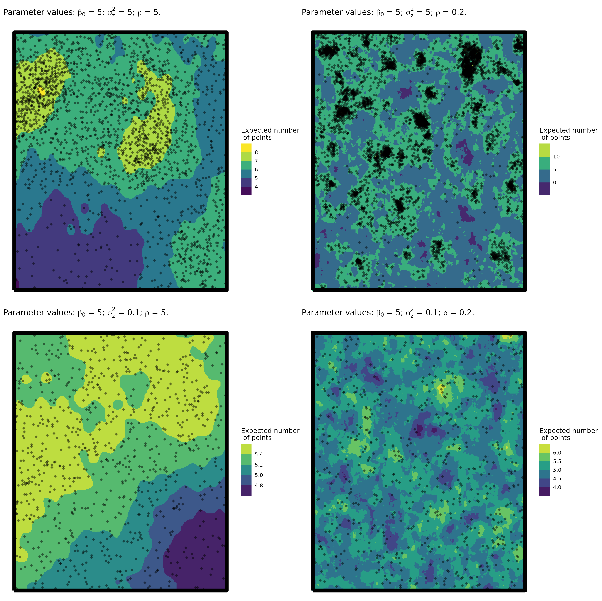
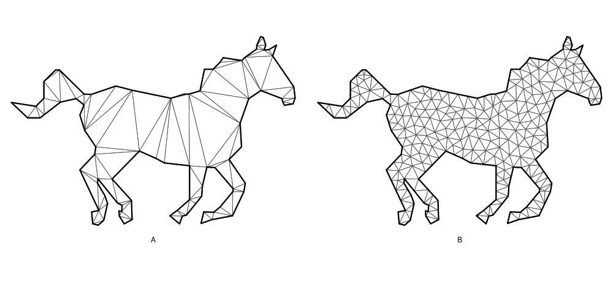
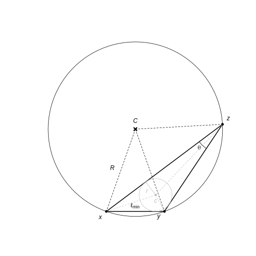
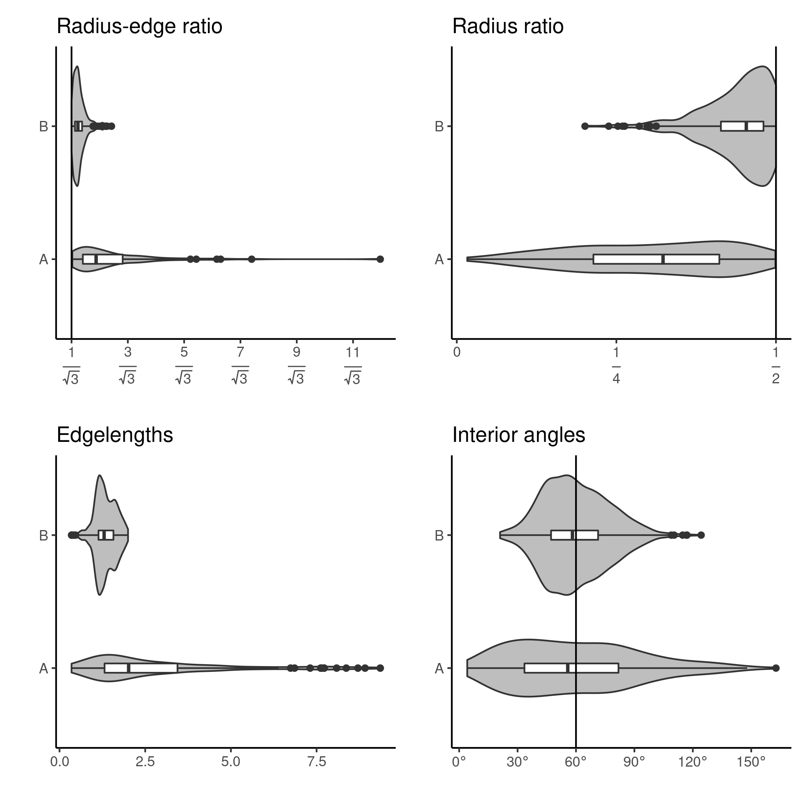
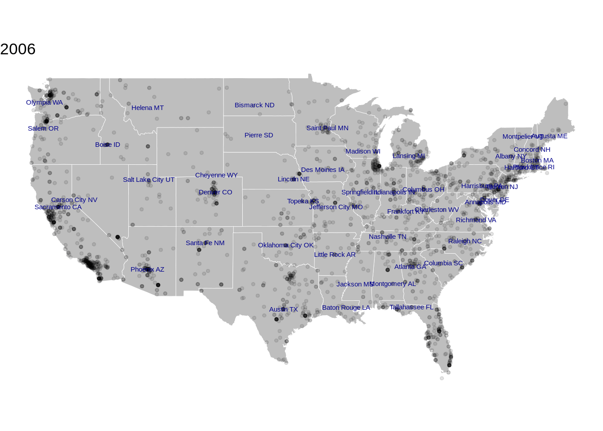
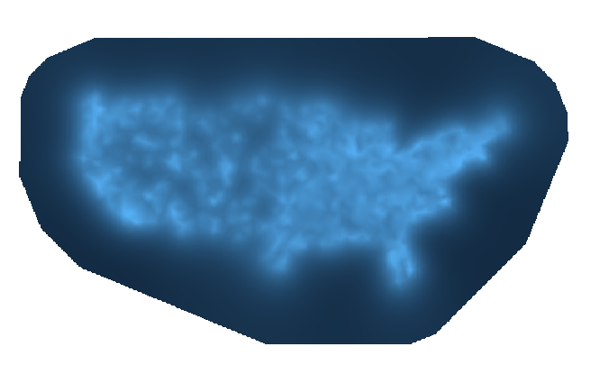
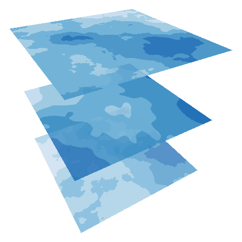

# A log-Gaussian Cox process

<br>

Intensity surface $\rightarrow$ $\{\Lambda(\boldsymbol{x}): x \in {\rm I\!R}^{2+1}\}$ .small[for 2D space and 1D time]
 <br>
 <br>
 <br>

Overall spatiotemporal intensity 
$\mu = \int_{{\rm I\!R^{2+1}}} \Lambda(\boldsymbol{x})dx$ where $$\Lambda(\boldsymbol{x}) = \textrm{exp}(\text{X}\beta + Z(\boldsymbol{x}) + \eta(\boldsymbol{x})).$$
<br>
 <br>

For Gaussian random field, $Z(\boldsymbol{x})$, with mean $\boldsymbol{\mu}$, and variance-covariance matrix $\boldsymbol{Q}^{-1}$ (with parameters $\rho$ and $\sigma^2_z$).

---
# Random fields

```{r, echo=FALSE,  out.width="60%"}

```


---
# Voronoi and Delaunay: the marriage

 <br>

```{r, echo=FALSE,  out.width="100%"}
knitr::include_graphics("img/mesh_plots.png")
```


---
# `r fontawesome::fa("box")` Can I gift wrap that for you? 

 <br>
 <br>


---
# `r fontawesome::fa("box")` Can I gift wrap that for you? 

 <br>
 <br>

```{r, echo=FALSE,  out.width="100%"}

```

.footnote[Work with Haiyi Shi] 

---
# `r fontawesome::fa("trophy")` And the winner is... 

  $\text{radius-edge ratio} = \frac{R}{l_{\text{min}}} = \frac{1}{2\text{sin}\theta}$
  
  $\text{radius ratio} = \frac{r}{R}$
 



.footnote[Work with Haiyi Shi] 
---
# So...

 <br>
 <br>
 <br>
 
 - We have the what `r fontawesome::fa("check")`
 <br>
 <br>
--

 - We have the how `r fontawesome::fa("check")`
 <br>
 <br>
--

 - But surely we should have started with the why `r fontawesome::fa("circle-question")`
 
---
# `r fontawesome::fa("circle-question")` 

```{r, echo=FALSE,  out.width="90%"}

```

---
# #academicfail

```{r}

```


---
# Marked point processes

Let $\Lambda(\boldsymbol{x})$ be our spatiotemporal LGCP intensity surface and $m_1(\boldsymbol{x})$ & $m_2(\boldsymbol{x})$ be marks (i.e., characteristics of the point).

<br>

A joint/mark model would then be given by

<br>

$$\begin{array}{l}
    \text{log}(\Lambda(\boldsymbol{x})) = \text{X}\beta + Z(\boldsymbol{x}) \\ 
     g(m_1(\boldsymbol{x})) = \tilde{\text{X}\beta} + \gamma_1\: Z(\boldsymbol{x})  + G(\boldsymbol{x})\\
      h(m_2(\boldsymbol{x})) = \text{X}\beta^\prime + \gamma_2\:Z(\boldsymbol{x}) + K(\boldsymbol{x}).\\
    \end{array}$$

<br>

Where $Z(\boldsymbol{x})$, $G(\boldsymbol{x})$ & $K(\boldsymbol{x})$ are each spatiotemporal random fields and $g()$ & $h()$ are the link functions for each mark.

---
# Marked point processes
<br>
<br>

.pull-left[


]


.pull-right[
<br>
<br>
<br>
$$ 
\left[
\begin{matrix}
1 & \gamma_1 & \gamma_2\\
0 & 1 & 0 \\
0 & 0 & 1 \\
\end{matrix}
\right]$$
]

---
# Self-exciting point processes

<br>
<br>
<br>
Points are conditional to the history of the process $H_t$

<br>

$$\lambda(\textbf{s},t|H_t) = \mu(\textbf{s}) + \Sigma_{i:t_i<t}g(s - s_i,t - t_i).$$


<br>
<br>

$$\textrm{log}(l(\boldsymbol{\theta})) = \int_{t, \textbf{s}} \mu(\textbf{s}) + \sum_{i = 1}^n \textrm{log}(\lambda(s_i, t_i)) - \int_{t, \textbf{s}} \sum_{i: t_i < t} g(s - s_i, t - t_i)$$
---
# Self-exciting point processes

.center[]


---

# References

<br>
<br>
<br>

 - Kristensen, K., Nielsen, A., Berg, C. W., Skaug, H., and Bell, B. M. (2016). TMB: Automatic Differentiation and Laplace Approximation. Journal of Statistical Software, 70(5), 1–21.
 
 - Lindgren, F., Rue, H. and Lindström, J. (2011). An explicit link between Gaussian fields and Gaussian Markov random fields: the stochastic partial differential equation approach. Journal of the Royal Statistical Society: Series B (Statistical Methodology), 73: 423--498.
 
 - Jones-Todd , C M , Swallow , B , Illian , J B and Toms , M. (2018). A spatiotemporal multispecies model of a semicontinuous response. Journal of the Royal Statistical Society: Series C (Applied Statistics), 67: 705--722.


---

# Diolch am wrando 

```{r, eval = FALSE, echo = FALSE}
## linux <sudo apt-get install cowsay>
```

.pull-left[
.animate__animated.animate__bounceInDown[
```{r dragon, echo = FALSE,eval = TRUE, comment = ""}
system2("cowsay", args = "-f dragon 'Questions?'", stdout = TRUE)
```
]
]


.pull-right[
<br>
.center[`r fontawesome::fa("circle-question")` UFO sightings]
<br>
.center[`r fontawesome::fa("twitter")` @cmjonestodd]
<br>
.center[`r fontawesome::fa("github")` @cmjt]
<br>
.center[`r fontawesome::fa("image")` [cmjt.github.io/slides/random](https://cmjt.github.io/slides/random)]
]


