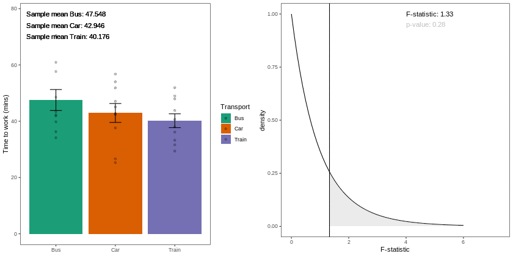
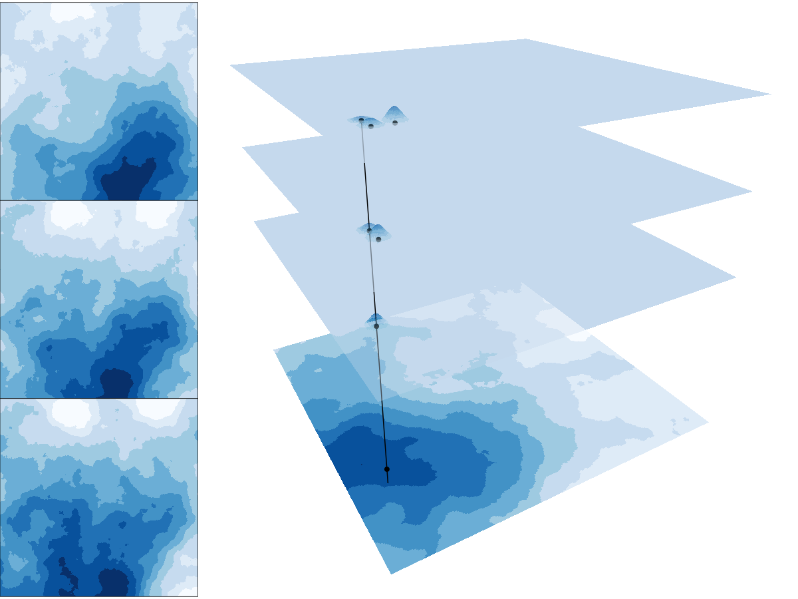
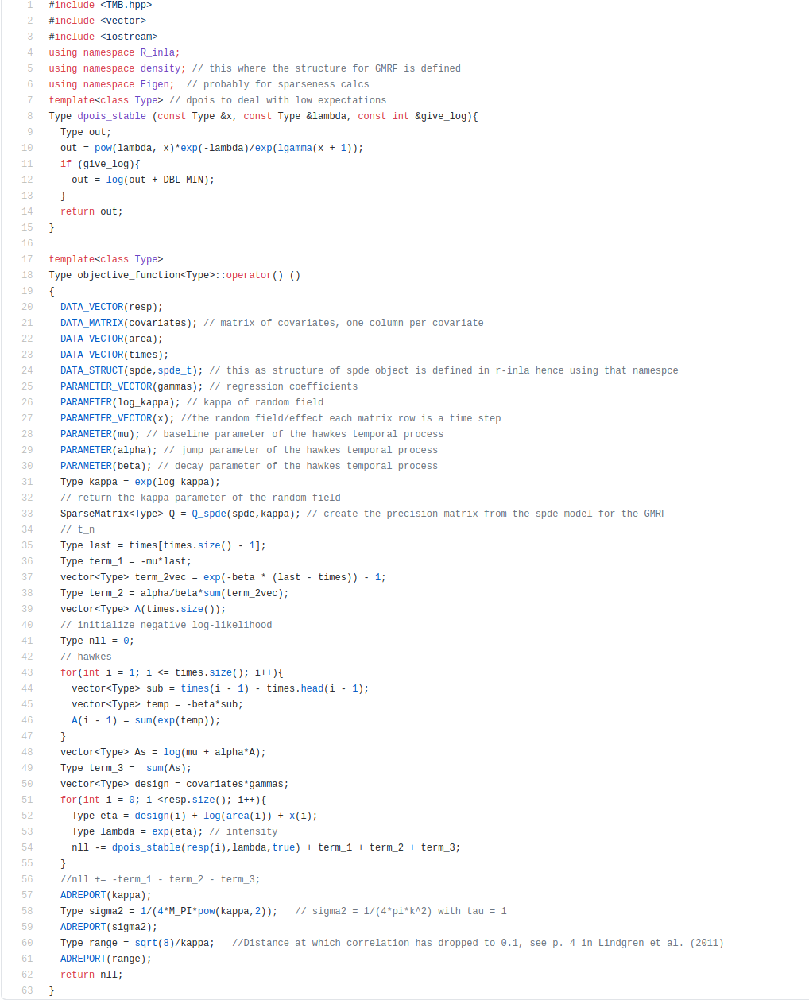

## University of St Andrews

.animate__animated.animate__rollIn.animate__slower[
.pull-left[
```{r, echo=FALSE, out.width="70%",fig.cap="Artwork by @allison_horst"}
knitr::include_graphics("https://raw.githubusercontent.com/allisonhorst/stats-illustrations/master/rstats-artwork/r_first_then.png")
```
]]

.pull-right[

]


.overlay-r[
<br>
<br>
<br>
<br>
<br>
<br>
<br>
<br>
<br>
<br>
.large[
`r icon::fa_github()` `r icon::fa_git_square()` `r icon::fa_linux()` `r knitr::include_graphics("https://upload.wikimedia.org/wikipedia/commons/thumb/0/08/EmacsIcon.svg/48px-EmacsIcon.svg.png")`
]
]
---

## NIWA

.animate__animated.animate__rollIn.animate__slower[
.pull-left[
```{r, echo=FALSE, out.width="70%",fig.cap="Artwork by @allison_horst"}
knitr::include_graphics("https://raw.githubusercontent.com/allisonhorst/stats-illustrations/master/rstats-artwork/welcome_to_rstats_twitter.png")
```
]]


.pull-right[

]

---

## NIWA

.pull-right[
<br>
<br>
<br>
<br>
```{r, echo=FALSE, out.width="45%"}
knitr::include_graphics("https://www.nesi.org.nz/sites/default/files/media/software%20carpentry%20logo.png")
```
]


.pull-left[

<br>
<br>
<br>
<br>
<br>
<br>
```{r, echo=TRUE, eval = FALSE}
files <- list.files(pattern = ".csv")
files <- lapply(files, read.csv)
res <- do.call('rbind',files)
```
]


--
<br>
<br>
<br>
.overlay[
.pull-left[
```{r, echo=FALSE, out.width="50%",fig.cap="Artwork by @allison_horst"}
knitr::include_graphics("https://raw.githubusercontent.com/allisonhorst/stats-illustrations/master/rstats-artwork/tidyverse_celestial.png")
```
]
]


---


## University of Auckland

.animate__animated.animate__rollIn.animate__slower[
.pull-left[

```{r, echo=FALSE, out.width="70%"}
knitr::include_graphics("https://pics.me.me/yours-is-the-worst-code-ihave-ever-run-but-it-60917985.png")
```
]]

.pull-right[
<br>
<br>
<br>

]
---

## Teaching 


.center[

]

.footnote[`r icon::fa_desktop()` [cmjt.github.io/statbiscuits](cmjt.github.io/slides/statbiscuits)]

---

## Teaching

.panelset[
 .panel[.panel-name[Gifs]
.center[

]
]

.panel[.panel-name[Stats memes]
.pull-left[
```{r, echo=FALSE, out.width="80%"}
knitr::include_graphics("https://d1b10bmlvqabco.cloudfront.net/attach/k2tzpqr1rjh2mv/k7cg6fnhql5w4/kaljzm66qd65/aov.jpg")
```
]
.pull-right[

]
]

.panel[.panel-name[RShiny]

.center[
`r icon::fa_desktop()` [https://cmjt.shinyapps.io/pdfplay/](https://cmjt.shinyapps.io/pdfplay/)
<iframe src="https://cmjt.shinyapps.io/pdfplay/" width="900"  height="400"></iframe>
]

]

.panel[.panel-name[aRt]
.center[
```{r, echo=FALSE, out.width="60%",fig.cap="Artwork by @allison_horst"}
knitr::include_graphics("https://raw.githubusercontent.com/allisonhorst/stats-illustrations/master/other-stats-artwork/type_1_errors.png")
```
]
]
.panel[.panel-name[live coding  `r emo::ji('scream')`]

```{r errors, echo = TRUE, error = TRUE}
data <- read.csv("data_file_not_in_my_working_directory.csv")

library(some_library_I_have_not_installed)

some_function_I_spelled_worng(x = x)

an_object_I_have_not_created

```


]
]

---

### Research

.panelset[
 .panel[.panel-name[Pretty plot]
 .center[
```{r, echo=FALSE, out.width="40%"}
knitr::include_graphics("https://pbs.twimg.com/media/DuKns0KX4AAvApq?format=jpg&name=small")
```
]
]

.panel[.panel-name[Paper]

[
```{r, echo=FALSE, out.width="50%"}

```
](http://onlinelibrary.wiley.com/doi/abs/10.1002/sim.8046)

]
]


---

### Research

.panelset[
 .panel[.panel-name[Pretty plot]
.center[
```{r, echo=FALSE, out.width="50%"}

```
]
]

.panel[.panel-name[Likelihood]

```{r, echo=FALSE, out.width="50%"}

```


]
]

---

## Vizualising rivers


.center[
```{r, echo=FALSE, out.height="90%"}
knitr::include_graphics("https://pbs.twimg.com/media/ETMf11xVAAAEfMw?format=png&name=small")
```
]

.footnote[`r icon::fa_desktop()` [https://gist.github.com/cmjt/238e6d01f5870f6c32e7870f51987650](https://gist.github.com/cmjt/238e6d01f5870f6c32e7870f51987650)]

---


```{r hexr, echo = FALSE, include = FALSE}
## devtools::install_github("cmjt/hexr") ## UNDER DEVELOPMENT
library(hexr)
library(sp)
library(ggplot2)
example <- hexr::get_hexr_data()
sf <- sf::st_as_sf(example)
ggplot(sf) +
    geom_sf()

```

`r chunk_reveal("hexr")`

---

```{r region, echo = FALSE, include = FALSE}
sf <- hexr::prep_hex(sf)

ggplot(sf,aes(colour = REGION)) + geom_sf() 
```

`r chunk_reveal("region")`

---

```{r hexes, echo = FALSE, include = FALSE}
ggplot(sf,aes(x = X, y = Y,river_id = NETWORK,xbins = 150)) +
    hexr::geom_rivers(fill = "grey80", color = "white",lwd = 0.1) +
    hexr::geom_river_fill(aes(var = DISTSEA/max(DISTSEA), seg = 1),
                           fill = "#D95F02",lwd = 0.1, colour = "white") +
    hexr::geom_river_fill(aes(var = DISTSEA/max(DISTSEA),seg = 2),
                           fill = "#00FFFF",lwd = 0.1, colour = "white")
```

`r chunk_reveal("hexes")`

---

```{r prep, echo = FALSE}
key <- "99acb780f2604ed19efed0e4dd0beb25"
library(magrittr)

```

```{r mfe, echo = FALSE, include = FALSE}
available <- hexr::mfe_data(key = key)
str(available)
mfe <- hexr::get_mfe_data(id = "layer-53318", key = key)
class(mfe)
```


`r chunk_reveal("mfe")`
---


## #dataviz  `r emo::ji('thinking')`

.center[

]

---


class: inverse

## Unwitting helpers


<br>
<br>

* @earowang: [intro to `r emo::ji('crossed_swords')`aringan](https://slides.earo.me/rladiesakl20)

* @annafergussonnz:  [everything `r emo::ji('cool')` `r emo::ji('cat')`](https://twitter.com/annafergussonnz)

* ...

--

* basically you put something on `r icon::fa_twitter(colour = "#00ACEE")` or `r icon::fa_github()` and I will steal it

--

* but feel free to steal from me too
   - [<i class="fas fa-images"></i> slides](https://github.com/cmjt/webpage) 
   - [<i class="fas fa-book-open"></i> teaching gifs](https://github.com/cmjt/statbiscuits)
   - [<i class="fas fa-signal"></i> RShiny distribution explorer](https://cmjt.shinyapps.io/pdfplay/)	

---

class: inverse

## Diolch am wrando

	

```{r, eval = FALSE, echo = FALSE}
## linux <sudo apt-get install cowsay>
```

.pull-left[
.animate__animated.animate__bounceInDown[
```{r dragon, echo = FALSE, comment = ""}
system2("cowsay", args = "-f dragon 'Questions?'", stdout = TRUE)
```
]
]
.pull-right[
<br>
<br>
<br>
.center[`r icon::fa_twitter(colour = "#00ACEE")` @cmjonestodd]
<br>
.center[`r icon::fa_github()` @cmjt]
<br>
.center[<i class="fas fa-images"></i>  [cmjt.github.io/slides/rladies](https://cmjt.github.io/slides/rladies)]

]
