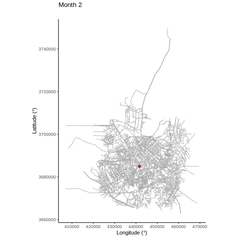

### Counting dots?


```{r pps,fig.width=15,fig.height=5}
library(spatstat)
set.seed(4321)
locs <- cbind(runif(100),runif(100))
pp <- ppp(locs[,1], locs[,2])
win <- owin()
par(mfrow = c(1,3), mar = c(0,0,0,0))
## point pattern
plot(locs,axes = "F",pch = 20,xlab = "",ylab = "",xlim = c(0,1),ylim = c(0,1),col = "darkgrey")
plot(win,add = TRUE)
## quadrat count
plot(locs,axes = "F",pch = 20,xlab = "",ylab = "",xlim = c(0,1),ylim = c(0,1),col = "darkgrey")
plot(win,add = TRUE)
q <- quadratcount(pp,5,5)
plot(q,add = TRUE,cex = 1.5)
## quad count finer matrix
plot(locs,axes = "F",pch = 20,xlab = "",ylab = "",xlim = c(0,1),ylim = c(0,1),col = "darkgrey")
plot(win,add = TRUE)
q <- quadratcount(pp,10,10)
plot(q,add = TRUE,cex = 1.5)
```

---


### But what about the unknown...

#### How low can you go?

.center[
```{r animation,  fig.show='animate', animation.hook='gifski'}
cols <- RColorBrewer::brewer.pal(9, "Blues")
s <- seq(5,50,5)
for(i in 1:length(s)){
  q <- quadratcount(pp,s[i],s[i])
  image(q,axes = FALSE,col = cols)
}
```
]

---
### But what about the unknown...

```{r cont, fig.width = 8, fig.height=8}
image(density(pp)$v,axes = FALSE,col = cols)
points(locs,pch = 20)
```

---
### But what about the unknown...

### Random fields

```{r rfs, fig.width=15,fig.height=5, fig.align='center'}
library(spatstat)
spatstat.options(npixel=300)
sigma2x <- c(1,1,3)
kappax <- c(2,3,10)
rangex <- sqrt(8*1)/kappax
beta0 <- 3
library(RandomFields)
set.seed(5432)
fields <- points <- list()
for (i in 1:3){
    lg.s <- rLGCP('matern', beta0,
                  var=sigma2x[i], scale=1/kappax[i], nu=1)
    ## points
    points[[i]] <- cbind(lg.s$x, lg.s$y)[,2:1]
    ## exponential of LGRF
    Lam <- attr(lg.s, 'Lambda')
    fields[[i]] <- log(Lam$v)
}
layout(matrix(c(0,1,2,3,4,
                0,0,0,0),nrow = 2,byrow = TRUE),respect = TRUE,
       widths = c(0.4,3,3,3,3),
       heights = c(3,0.2))

par(mar = c(0,0,0,0),xpd = TRUE,oma = c(0,0,0,0))
x <- seq(1,5, length.out = 100)
plot(x, rSPDE::matern.covariance(x, kappa = kappax[1], nu = 1, sigma = sqrt(sigma2x[1])),
     type = "l", ylab ="", xlab = "",lwd = 2,xaxt = "n")
mtext(line = 0.5, side = 1, "Distances between points")
mtext(line = 2,side = 2, expression(C[z]))
lines(x,rSPDE::matern.covariance(x, kappa = kappax[2], nu = 1, sigma = sqrt(sigma2x[2])), lty = 2,lwd = 2)
lines(x,rSPDE::matern.covariance(x, kappa = kappax[3], nu = 1, sigma = sqrt(sigma2x[3])), lty = 3,lwd = 2)
legend("topright",bty = "n", lty = 1:3,lwd = 2, legend = c("i)","ii)", "iii)"),cex = 2)
## fields
image(fields[[1]],axes = FALSE,  col = RColorBrewer::brewer.pal(9, "Blues"),asp = 1)
points(points[[1]],pch = 20)
legend(-0.05,0.1,bty = "n", cex = 2,legend = "i)")
box()
image(fields[[2]],axes = FALSE,  col = RColorBrewer::brewer.pal(9, "Blues"), asp = 1)
points(points[[2]],pch = 20)
legend(-0.05,0.1,,bty = "n", cex = 2,legend = "ii)")
box()
image(fields[[3]],axes = FALSE,  col = RColorBrewer::brewer.pal(9, "Blues"),asp = 1)
points(points[[3]],pch = 20)
legend(-0.05,0.1,,bty = "n", cex = 2,legend = "iii)")
box()
```

---
### `r emo::ji("bed")` Bed sheets?

.center[
```{r spde,fig.height=8,fig.width=8,fig.align='center'}
library(plotly)
n <- seq(-4,4,length.out = 10)
n <- rep(n, each = 10) 
z <- outer(X = n,Y = n,function(X,Y) sin(X)*cos(Y))
## smoother
n <- seq(-4,4,length.out = 100)
z2 <-  outer(X = n,Y = n,function(X,Y) sin(X)*cos(Y)) + 2

p <- plot_ly(showscale = FALSE) %>%
  add_surface(z = ~z, cmin = min(z), cmax = max(z), colorscale = list(c(0, 1), c("#F7FBFF", "#08306B"))) %>%
  add_surface(z = ~z2, cmin = min(z2), cmax = max(z2),colorscale = list(c(0, 1), c("#F7FBFF", "#08306B")), opacity = 0.98) %>%
layout(
    title = "",
    scene = list(
      xaxis = list(title = "",zeroline = FALSE,showline = FALSE,showticklabels = FALSE,showgrid= FALSE),
      yaxis = list(title = "",zeroline = FALSE,showline = FALSE,showticklabels = FALSE,showgrid= FALSE),
      zaxis = list(title = "",zeroline = FALSE,showline = FALSE,showticklabels = FALSE,showgrid= FALSE)
    )) %>% config(displayModeBar = FALSE)
p
```
]

.footnote[[Lindgren, F., Rue, H., and Lindström, J. (2011). An explicit link between Gaussian fields and
Gaussian Markov random fields: the stochastic partial differential equation approach. Journal
of the Royal Statistical Society: Series B (Statistical Methodology), 73(4):423–498.](https://rss.onlinelibrary.wiley.com/doi/pdf/10.1111/j.1467-9868.2011.00777.x)]
---

### `r emo::ji("knife")` Cutting up space (cleverly)

```{r mesh,fig.height=7,fig.width=7}
library(INLA)
mesh <- inla.mesh.2d(loc = cbind(runif(100),runif(100)),max.edge = c(0.1,0.3),cutoff = 0.07)
image(z2,axes = FALSE,col = cols)
plot(mesh,main = "",add = TRUE)
points(mesh$loc,pch = 20)
```

.footnote[[Lindgren, F., Rue, H., and Lindström, J. (2011). An explicit link between Gaussian fields and
Gaussian Markov random fields: the stochastic partial differential equation approach. Journal
of the Royal Statistical Society: Series B (Statistical Methodology), 73(4):423–498.](https://rss.onlinelibrary.wiley.com/doi/pdf/10.1111/j.1467-9868.2011.00777.x)]

---
### Murders in NZ as a LGCP

.pull-left[
<br>
<br>
<br>
<br>
<br>
$$\Lambda(\mathbf{s}) =  \text{exp}(\beta_0  + G(\mathbf{s}))$$
$$\Lambda(\mathbf{s}) =  \text{exp}(\beta_0  +  \Sigma_{k = 1}^{n_{\text{covs}}} \alpha_k\: x_q(\mathbf{s}) + G(\mathbf{s}))$$
]

.pull-right[
```{r murders, fig.align='center',fig.width=8,fig.height=8}
library(stelfi)
## nz data
data(murders_nz)
data(nz)
## data wrangling
coordinates(murders_nz) <- c("Longitude","Latitude")
proj4string(murders_nz) <- CRS("+proj=longlat +datum=WGS84")
murders_nz <-  spTransform(murders_nz, 
                           CRS("+proj=nzmg +lat_0=-41.0 +lon_0=173.0 +x_0=2510000.0 +y_0=6023150.0 +ellps=intl +units=m"))
nz_clip <- stplanr::gclip(nz,murders_nz)
plot(murders_nz);plot(nz, add = TRUE)

```
]

.footnote[Work with Charlie Timings, honours student]

---

### Murders in NZ as a LGCP


```{r plot weights, fig.width=8,fig.height=8}
## function below is a wrapper for
## the book.dual.mesh() function supplied
## in the INLA-SPDE tutorial mentioned above
mesh <- inla.mesh.2d(loc.domain = broom::tidy(nz_clip)[,1:2],
                     max.edge = c(85000,105000), cutoff = 85000)
weights <- stelfi::get_weights(mesh = mesh, sp = nz, plot = FALSE)
dual_mesh <- stelfi:::inla.mesh.dual(mesh)
## expected number per mesh node
ins <- which(weights != 0)
pal <- scales::col_numeric("Blues",weights[ins]/1000^2)
cols <- pal(weights[ins]/1000^2)
plot(dual_mesh[ins], col = cols)
plot(nz, add = TRUE)
## fields::image.plot(zlim = range(weights[ins]/1000^2),col = sort(cols, TRUE), legend.only = TRUE, legend.width = 2, nlevel = 10, legend.shrink = 0.5)
```
*Voronoi diagram of the weights (shown as areas in km2 around each mesh node).*

.footnote[Work with Charlie Timings, honours student]

---
### Murders in NZ as a LGCP

```{r mod1}
## lgcp model
fit <- fit_lgcp_inla(mesh = mesh, locs = coordinates(murders_nz), sp = nz_clip,
                     return.attributes = TRUE)

```


```{r murders_fit, fig.align='center',fig.width=8,fig.height=8}
fields <- stelfi::get_fields(fit, mesh, mean = TRUE)
grfs <- fields[[1]]
r <- range(grfs)
proj = INLA::inla.mesh.projector(mesh, dims = c(300,300))
field.proj = INLA::inla.mesh.project(proj, grfs)
image(list(x = proj$x, y=proj$y, z = field.proj),col = RColorBrewer::brewer.pal(9, "Blues"), 
      axes = FALSE, zlim = r,asp = 1)
plot(nz,add = TRUE)

```

.footnote[Work with Charlie Timings, honours student]
  
 
---
### Other work: Self-exciting fields

.center[]

---

### Other work: Network distances
.center[]


---


### Diolch am wrando 

```{r, eval = FALSE, echo = FALSE}
## linux <sudo apt-get install cowsay>
```

.pull-left[
.animate__animated.animate__bounceInDown[
```{r dragon, echo = FALSE,eval = TRUE, comment = ""}
system2("cowsay", args = "-f dragon 'www.slido.com  (115)'", stdout = TRUE)
```
]
]


.pull-right[
<br>
<br>
<br>
.center[`r icon::fa_twitter(colour = "#00ACEE")` @cmjonestodd]
<br>
.center[`r icon::fa_github()` @cmjt]
<br>
.center[<i class="fas fa-images"></i>  [cmjt.github.io/slides/sbs](https://cmjt.github.io/slides/sbs)]
]


