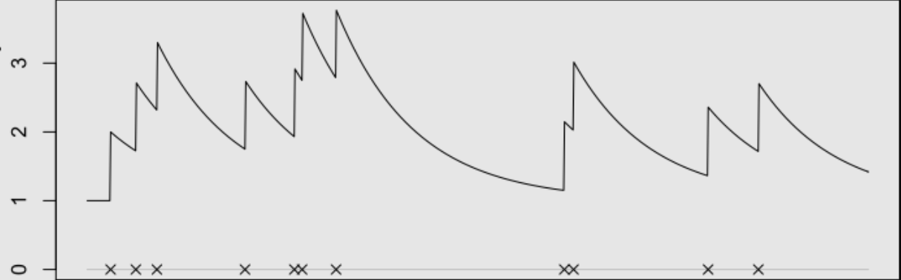
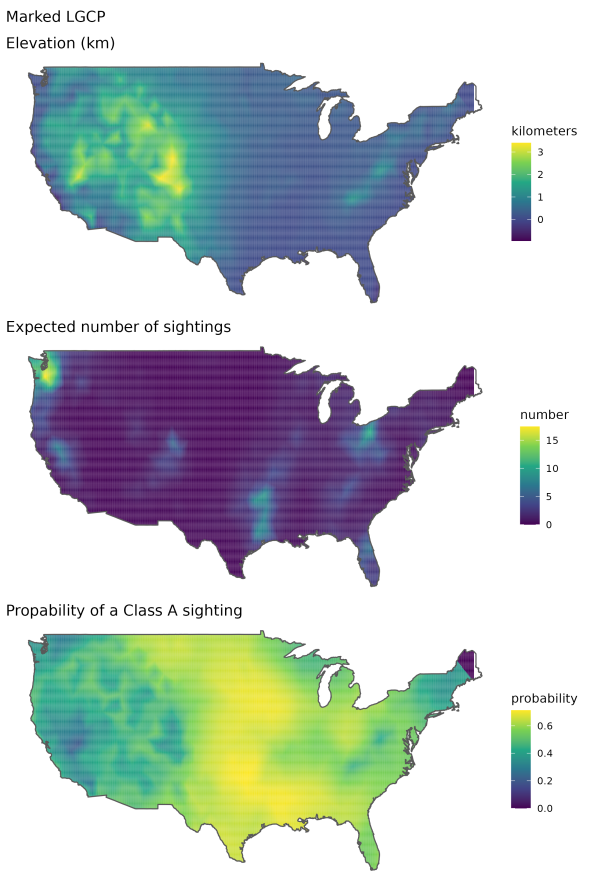
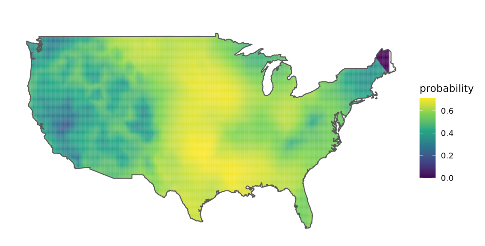

```{r setup, include=FALSE}
options(htmltools.dir.version = FALSE)
knitr::opts_chunk$set(message = FALSE,cache = TRUE, echo = FALSE, warning = FALSE, fig.align='center')
require(tidyverse)
```

--- 
# `r fontawesome::fa("check")` I am not a robot


```{r, echo=FALSE,  out.width="40%"}
knitr::include_graphics("img/recaptcha.jpg")
```


---

# `r fontawesome::fa("question-circle")` 

.center[

]


---


# A self-exciting point process (Hawkes model)

<br>
<br>


$$\lambda(t) = \color{red} \mu + \color{blue} \alpha \Sigma_{i:\tau_i<t}\text{exp}(-\color{green}\beta * (t-\tau_i))$$ 

 - $\color{red} \mu$, background rate
 - $\color{blue} \alpha$, increase in intensity after an event
 - $\color{green}\beta$, exponential decay
 - $\Sigma_{i:\tau_i<t} \cdots$, historic dependence
 - $\frac{\color{blue} \alpha}{\color{green}\beta}$, branching ratio (average number events triggered by an event)
 - $\frac{1}{\color{green}\beta}$, rate of decay of self-excitement
 
.center[

]

---

# Log-likelihood (it's nasty)

<br>
<br>

$$\sum_{i=1}^k \text{log} \left [\lambda + \alpha \sum_{j=1}^{i-1}\text{exp}(-\beta(t_i - t_j))\right ] -\lambda t_k + \frac{\alpha}{\beta} \sum_{i=1}^k \left [ \text{exp}(-\beta(t_k - t_i)) - 1\right ]$$
$$\vdots$$

$$\sum_{i=1}^k \text{log} \left [\lambda + \alpha A(i)\right ] -\lambda t_k + \frac{\alpha}{\beta} \sum_{i=1}^k \left [ \text{exp}(-\beta(t_k - t_i)) - 1\right ]$$
where, 

$$A(i) = \text{exp}(-\beta(t_i - t_{i-1}))(1 + A(i-1)).$$

---

# Temporal rate of retweets 


.center[

]

---

# Temporal rate of retweets 

<br>
<br>
<br>

$$\lambda(t) = \color{red} \mu + \color{blue} \alpha \Sigma_{i:\tau_i<t}\text{exp}(-\color{green}\beta * (t-\tau_i))$$ 

 +  $n = 4890$ retweets over $\text{T} = 3143$ mins (~2 days)

 + $\color{red} {\hat{\mu}} \text{T} = 0.063 \times 3143 \sim 198$ 'baseline' tweets

 + Expected number of retweets triggered by any one tweet $\frac{\color{blue}{\hat{\alpha}}}{\color{green}{\hat{\beta}}} \sim 0.94$
 
 + Rate of decay for the self-excitement $\frac{1}{\color{green}{\hat{\beta}}} = \frac{1}{0.079} \sim 12$ mins


---

# `r fontawesome::fa("question-circle")` 

<video width="500" height="20"  controls>
  <source src="img/whale.mp3" type="video/mp4">
</video>

--

.center[

]

---

# A self-exciting cue rate model

<br>
<br>
<br>


$$\lambda(t) = \color{red} {\mu(t)} + \color{blue} \alpha \Sigma_{i:\tau_i<t}\text{exp}(-\color{green}\beta * (t-\tau_i))$$

where

$$\text{log}(\color{red} {\mu(t)}) = \beta_{1} I_{s(t)} + \beta_2 d(t) + \beta_3 r(t)$$

 - $d(t)$, depth
 - $r(t)$, rate of descent (+ve when descending, -ve when ascending)
 - $I_{s(t)} = 0$ on 'surface' $= 1$ when in 'deep water'

---

# Underdispersion

<br>
<br>

Now, a Hawkes Process is an inhomogeneous Poisson process:

 + at any time $\tau_i$ the number of events $N(t) \sim \text{Poisson}( \int_0^{\tau_i} \lambda(t) dt)$,
 + therefore the difference between the compensators $\int_0^{\tau_i} \lambda(t) dt$ for consecutive events assumes an exponential distribution with mean 1...

--

<br>
<br>

But, this is not the case here so, we assume a Weibull distribution with dispersion parameter $k$
 
  + when $k = 1$ we have an exponential distribution again.


---

# Cue rate


.center[

]


---

# Dispersion parameter

<br>
<br>


.center[

]

---

# `stelfi`

```{r, eval = FALSE, echo = FALSE}
namedropR::drop_name("bib.bib", cite_key = "stelfi",use_xaringan = TRUE, style = "newspaper", qr_size = 150, author_size = "8pt", title_size = "12pt", journal_size = "10pt")
```

`r htmltools::includeHTML("visual_citations/stelfi.html")`
<br>
<br>

.center[

]

---

# `r fontawesome::fa(name = "list-check")` `INLA`

Integrated Nested Laplace Approximation (INLA)

--
 
  - Approximate Bayesian inference for Latent Gaussian Models
  
  - `INLA`verse
    - `INLABMA`
    - `inlabru`
    - `INLAMSM`
    - `nmaINLA`
    - `rSPDE` 
    - ...


---

# INLA-SPDE

<br>
<br>


---

# Spatial LGCP  

<br>
<br>
 
$$\Lambda(\underline{s}) = \text{exp}(\boldsymbol{X \beta} + G(\underline{s}) + \epsilon)$$

  - $\boldsymbol{X \beta}$, design matrix
  - $G(\underline{s})$, Gaussian Markov Random Field (GMRF)
  - $\epsilon$, error 

$G(\underline{s})$ has a Matérn covariance with parameters $\tau$ and $\kappa$, where  
  - $r=\frac{\sqrt{8}}{\kappa}$ is the range, and 
  - $\sigma=\frac{1}{\sqrt{4\pi\kappa^2\tau^2}}$ standard deviation


---

# `r fontawesome::fa(name = "list-check")` `TMB`

<br>
<br>
<br>


 Template Model builder (`TMB`) `R` package for fitting latent variable models
  - Calculates first and second order derivatives of the likelihood function by AD (or any objective function written in `C++`)
  - The objective function (and its derivatives) can be called from `R`
  - The user can specify that the Laplace approximation should be applied to any subset of the function arguments
     - Yields marginal likelihood in latent variable model
  - Standard deviations of any parameter, or derived parameter, obtained by the delta method


---

# `TMB` in summary

<br>
<br>
<br>

A TMB project consists of an `R` file and a `C++` file. The R file does pre- and post processing of data in addition to maximizing the log-likelihood contained in *.cpp.

The purpose of the C++ program is to evaluate the objective function. The program is compiled and called from R, where it can be fed to a function minimizer (e.g., `nlminb()`).

---

# `TMB` in summary


---

# `r fontawesome::fa("question-circle")` 

<video width="500" height="20"  controls>
  <source src="img/whoop.mp3" type="video/mp4">
</video>

--

.center[

]


---

# `r fontawesome::fa("circle-question")` Sasquatch/Bigfoot

.pull-left[
<br>
<br>
]

.pull-right[]


[](https://www.bfro.net/)
---

# A marked LGCP

Setting $m_i = 1$ if the Bigfoot sighting is classified as clear (Class A) and  $m_i = 0$ if the sighting is not (class B). 

<br>
<br>

.center[

]


---

# A joint model

<br>
<br>
<br>
<br>

The model:


$$\Lambda(\boldsymbol{s}) = \text{exp}(\beta_0 + \beta_1 x_{\text{elev}}(s) +  G(\boldsymbol{s}) + \epsilon)$$
$$\text{logit}(p(\boldsymbol{s}))^{-1} = \beta_{0^m} + \beta_1^m x_{\text{elev}}(s) + G_m(\boldsymbol{s}) +\alpha_{m}\; G(\boldsymbol{s}) + \epsilon_{m}$$

where $m(s) \sim \text{Bernoulli}(p(\boldsymbol{s}))$ and the spatial intensity of all sightings is, as previously, $\Lambda(\boldsymbol{s})$. A spatial covariate, $x_{\text{elev}}(s)$ the elevation in kilometers. 


---

# A joint model
 
.pull-left[
<br>
<br>
<br>

 | Parameter | est.    | se   |
 |-----------|---------|------|
 | $\beta_0$ | -0.823  | 0.358 | 
 | $\beta_1$ | 0.114  | 0.251  |
 | $\beta_0^m$ | 0.227  | 0.284 |
 | $\beta_1^m$ | -0.372  | 0.178 |
 | $\alpha_m$ | 0.044  | 0.063 |
]

.pull-right[

]


---
# Probability of a first-hand sighing


.center[

]


---

# But, is seeing Bigfoot contagious?

<br>
<br>
<br>

.center[

]


---
# So, is seeing Bigfoot contagious?

<br>
<br>

$$\lambda(t) = \color{red} \mu + \color{blue} \alpha \Sigma_{i:\tau_i<t}\text{exp}(-\color{green}\beta * (t-\tau_i))$$ 
<br>
<br>

 +  $n = 972$ sightings over $\text{T} = 2188$ days

 + $\color{red} {\hat{\mu}} \text{T} = 0.12 \times 2188 \sim 263$ baseline sightings

 + Expected number of sightings triggered by any one sighting $\frac{ \color{blue}{\hat{\alpha}}}{ \color{green}{\hat{\beta}}} = \frac{0.06}{0.09} = \frac{2}{3}$

 + Expected number of descendants per sighting $\frac{\color{green}{\hat{\beta}}}{\color{green}{\hat{\beta}} - \color{blue}{\hat{\alpha}}} = \frac{0.09}{0.09 - 0.06} = 3$
 
 + Rate of decay for the self-excitement $\frac{1}{\color{green}{\hat{\beta}}} = \frac{1}{0.09} \sim 11$ days

---

# A spatiotemporal self-exciting process 

<br>
<br>

  $$\lambda(\boldsymbol{s},t) = \color{red} \mu + \color{blue} \alpha \Sigma_{i:\tau_i<t}\left [ \text{exp}(-\color{green}\beta * (t-\tau_i)) \color{purple}{K_i(\boldsymbol{s} - \boldsymbol{x}_i, t - \tau_i)} \right ] + \color{orange} {G(\boldsymbol{s})} + \epsilon$$

where $\boldsymbol{x}_i$ are the spatial locations.

The spatial self-excitement kernel is given by $\color{purple}{K_i(\boldsymbol{s} - \boldsymbol{x}_i, t - \tau_i)} \sim \text{Normal}(0, \boldsymbol{Q^{-1}})$, can either be time-independent where $\boldsymbol{Q^{-1}} = \begin{bmatrix} \sigma_x^2 & \rho \sigma_x \sigma_y \\ \rho \sigma_x \sigma_y & \sigma_y^2 \end{bmatrix}$ or time-dependent where $\boldsymbol{Q^{-1}} = \begin{bmatrix} \sigma_x^2 & \rho \sigma_x \sigma_y \\ \rho \sigma_x \sigma_y & \sigma_y^2 \end{bmatrix}\times (t_j - t_i)$ for $t_j > t_i$.

$\color{orange} {G(\boldsymbol{s})}$ is an (optional) Gaussian random field. 

---
# Reported Bigfoot sightings


.center[

]


---

# Spatiotemporal self-exciting process 

.center[

]


---

# Other work:  self-exciting SCR

.footnote[.tiny[Alec van Helsdingen's work inspired by Ben Stevenson, don't ask me too many questions :)]]

 The idea is to model $\lambda_{ij}(t)$, the 'intensity' of animal $i$ at camera $j$ over time $t$:
 
 $$\lambda_{ij}(t) = \mu_0 \left[H_{ij} + \text{exp}(-\beta (t - \tau_i(t)))(S_{ij}(t) - H_{ij})\right]$$
  - $H_{ij}$ bivariate normal centered on the home range
  - $S_{ij}(t)$ bivariate normal 'spike' in intensity immediately after detection centered on the camera
 
--

.pull-left[

]

--

.pull-right[

]


---

# Other work 


 
 - Networks using the SPDE

.center[

]

--

 - GOF, WIP

---


```{r, eval = FALSE, echo = FALSE}
## linux <sudo apt-get install cowsay>
## devtools::install_github('emitanaka/anicon')
```

.pull-left[
.animate__animated.animate__bounceInDown[
```{r dragon, echo = FALSE,eval = TRUE, comment = ""}
system2("cowsay", args = "-f dragon 'Diolch am wrando'", stdout = TRUE)
```
]
]

.pull-right[
.center[
 &nbsp; &nbsp;

]
.center[[`r anicon::faa('twitter', animate='float', rtext='@cmjonestodd')`](https://twitter.com/cmjonestodd)]
<br>
.center[[`r anicon::faa("github", animate="float")` @cmjt](https://github.com/cmjt)]
<br>
.center[[`r anicon::faa("google", animate="float")` cmjt.github.io](https://cmjt.github.io)]
]


