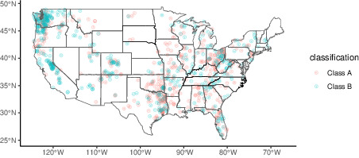
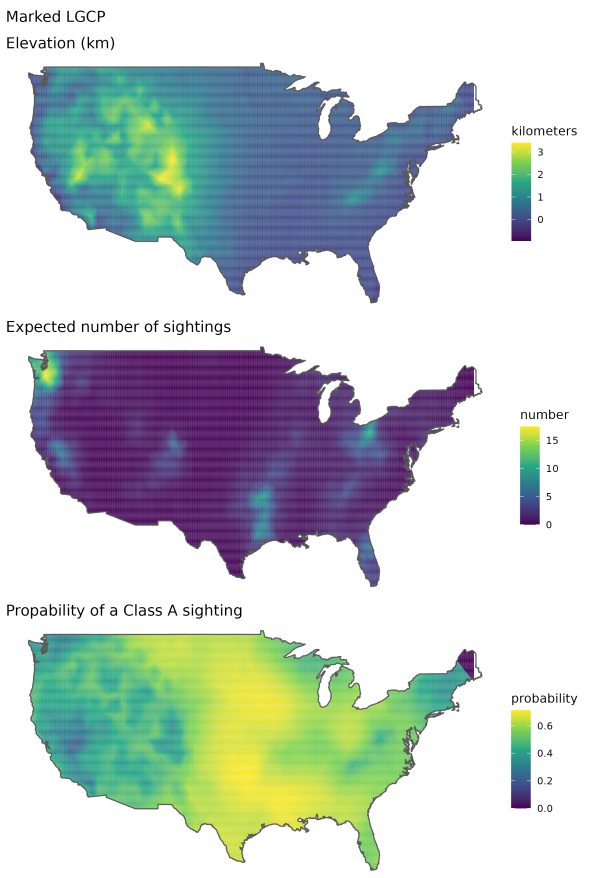
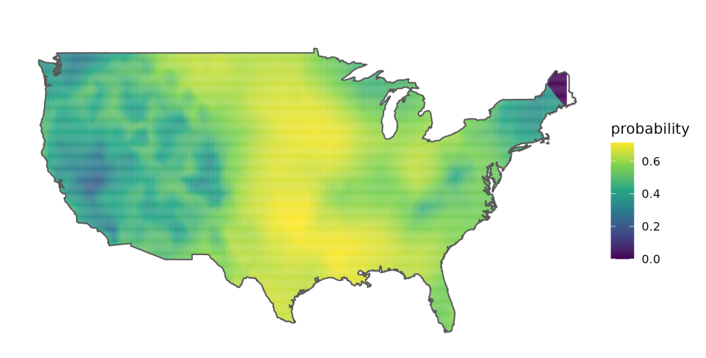

```{r setup, include=FALSE}
options(htmltools.dir.version = FALSE)
knitr::opts_chunk$set(message = FALSE,cache = TRUE, echo = FALSE, warning = FALSE, fig.align='center')
require(tidyverse)
```

# `stelfi`

```{r, eval = FALSE, echo = FALSE}
namedropR::drop_name("bib.bib", cite_key = "stelfi",use_xaringan = TRUE, style = "newspaper", qr_size = 150, author_size = "8pt", title_size = "12pt", journal_size = "10pt")
```

`r htmltools::includeHTML("visual_citations/stelfi.html")`
<br>
<br>

.center[

]


---

# `r fontawesome::fa(name = "list-check")` `stelfi`

<br>
<br>
<br>
<br>


`TMB`: `R` package for fitting latent variable models
  - Calculates first and second order derivatives of the likelihood function by AD (or any objective function written in `C++`)
  - User specifies which function arguments the Laplace approximation should be applied to
  

      
---

# Spatial LGCP  


 
$$\Lambda(\underline{s}) = \text{exp}(\beta_0 + G(\underline{s}) + \epsilon)$$

  - $\beta_0$, intercept
  - $G(\underline{s})$, Gaussian Markov Random Field (GMRF)
  - $\epsilon$, error 

$G(\underline{s})$ has a Matérn covariance defined by $\tau$ and $\kappa$, where  
  - $r=\frac{\sqrt{8}}{\kappa}$ is the range, and 
  - $\sigma=\frac{1}{\sqrt{4\pi\kappa^2\tau^2}}$ standard deviation

--

`fit_lgcp(locs, sf, smesh, parameters)`

 - `locs`, matrix of locations
 - `sf`, an `sf` object of the spatial domain
 - `smesh`, a `INLA::inla.mesh.2d` object
 - `parameters`, vector of parameter starting values

---

# Spatiotemporal LGCP 

<br>
<br>


$$\Lambda(\underline{s}, t) = \text{exp}(\beta_0 + G(\underline{s}, t) + \epsilon)$$
 - $\beta_0$, intercept
 - $G(\underline{s}, t)$, a spatiotemporal GMRF
 - $\epsilon$, error 

--

`fit_lgcp(locs, sf, smesh, tmesh, parameters)`

 - `locs`, matrix of locations
 - `sf`, an `sf` object of the spatial domain
 - `smesh`, a `INLA::inla.mesh.2d` object
 - `tmesh`,  a `INLA::inla.mesh.1d` object
 - `parameters`, vector of parameter starting values

---

# A marked LGCP

<br>
<br>

$$\Lambda_{pp}(s) = \text{exp}(\beta_{pp} + G_{pp}(s) + \epsilon_{pp})$$
$$\Lambda_{m_j}(s) = f^{-1}(\beta_{m_j} + G_{m_j}(s) + \alpha_j\; G_{pp}(s) + \epsilon_{m_j})$$


 - $\alpha_j$ ($j = 1, ..., n_{\text{marks}}$) are coefficient(s) linking the point process and the mark(s). 

 - $\Lambda_{m_j}(s)$ depends on the assumed distribution of the marks e.g.,
   
   1. If $m_j \sim \text{Normal}(\mu_j(\boldsymbol{s}), \sigma_j)$ then $M_j(\boldsymbol{s}) =  \mu_j(s)$ and $f^{-1} = \text{I()}$,
   2. If $m_j \sim \text{Poisson}(\Lambda_j(\boldsymbol{s}))$ then $M_j(\boldsymbol{s}) =  \Lambda_j(s)$ and $f^{-1} = \text{exp()}$,
   3. If $m_j \sim \text{Binomial}(n_j, p_j(\boldsymbol{s}))$ then $M_j(\boldsymbol{s}) =  p_j(s)$ and $f^{-1} = \text{logit()}$, and
   4. If $m_j \sim \text{Gamma}(\text{shape}_j(\boldsymbol{s}), \text{scale}_j)$ then $M_j(\boldsymbol{s}) =  \text{shape}_j(\boldsymbol{s})$ and $f^{-1} = \text{log()}$.
 
---

# A marked LGCP

<br>
<br>

`fit_mlgcp(locs, marks, sf,  smesh, parameters, methods, fields, covariates)`

  - `marks`, matrix of marks at each location in `locs`
  - `methods`, integer(s) choice of mark distribution(s)
  - `fields`, binary vector, should a mark specific random field be included
  - `covariates`, a matrix of covariates can be set on either the marks, or LGCP, or both.
  
---
# `r fontawesome::fa("question-circle")` 

.footnote[.tiny[First to yell out the correct answer gets my permission to skip the queue @ lunch tomorrow]]

<video width="500" height="20"  controls>
  <source src="img/whoop.mp3" type="video/mp4">
</video>

--

.center[

]


---

# `r fontawesome::fa("circle-question")` Sasquatch/Bigfoot

.pull-left[
<br>
<br>
]

.pull-right[]


[](https://www.bfro.net/)
---


# A marked LGCP example

Setting $m_i = 1$ if the Bigfoot sighting is classified as clear (Class A) and  $m_i = 0$ if the sighting is not (class B). 

<br>
<br>

.center[

]


---

# Probability of a first-hand sighing

<br>
<br>
<br>
<br>

The joint model we fit is


$$\Lambda(\boldsymbol{s}) = \text{exp}(\beta_0 + \beta_1 x_{\text{elev}}(s) +  G(\boldsymbol{s}) + \epsilon)$$
$$\text{logit}(p(\boldsymbol{s}))^{-1} = \beta_{0^m} + \beta_1^m x_{\text{elev}}(s) + G_m(\boldsymbol{s}) +\alpha_{m}\; G(\boldsymbol{s}) + \epsilon_{m}$$

where $m(s) \sim \text{Bernoulli}(p(\boldsymbol{s}))$ and the spatial intensity of all sightings is, as previously, $\Lambda(\boldsymbol{s})$. A spatial covariate, $x_{\text{elev}}(s)$ the elevation in kilometres 


---

# A joint model
 
.pull-left[
<br>
<br>
<br>

 | Parameter | est.    | se   |
 |-----------|---------|------|
 | $\beta_0$ | -0.823  | 0.358 | 
 | $\beta_1$ | 0.114  | 0.251  |
 | $\beta_0^m$ | 0.227  | 0.284 |
 | $\beta_1^m$ | -0.372  | 0.178 |
 | $\alpha_m$ | 0.044  | 0.063 |
]

.pull-right[

]


---
# Probability of a first-hand sighing


.center[

]


---

# But, is seeing Bigfoot contagious?

<br>
<br>
<br>

.center[

]

---

# ETAS-type model

<br>
<br>


$$\lambda(t; m(t)) = \mu + \alpha \Sigma_{i:\tau_i<t}m(\tau_i)\text{exp}(-\beta * (t-\tau_i)) $$ 

 - $\mu$, background rate
 - $m(t)$, temporal mark
 - $\Sigma_{i:\tau_i<t} \cdots$, historic dependence 
 
--

`fit_hawkes(times, parameters, marks)`

 - `times`, vector of times
 - `parameters`, starting values of parameters
 - `marks`, (optional) vector of marks
 

---
# So, is seeing Bigfoot contagious?

<br>
<br>

$$\lambda(t) = \mu + \alpha \Sigma_{i:\tau_i<t}\text{exp}(-\beta * (t-\tau_i)) + \epsilon$$
<br>
<br>

 +  $n = 972$ sightings over $\text{T} = 2188$ days

 + $\hat{\mu} \text{T} = 0.12 \times 2188 \sim 263$ baseline sightings

 + Expected number of sightings triggered by any one sighting $\frac{\hat{\alpha}}{\hat{\beta}} = \frac{0.06}{0.09} = \frac{2}{3}$. 

 + Expected number of descendants per sighting $\frac{\hat{\beta}}{\hat{\beta} - \hat{\alpha}} = \frac{0.09}{0.09 - 0.06} = 3$
 
 + Rate of decay for the self-excitement $\frac{1}{\hat{\beta}} = \frac{1}{0.09} \sim 11$ days.

---

# Extension: An inhomogeneous Hawkes process 

<br>
<br>

$$\lambda(t) = \mu(t) + \alpha \Sigma_{i:\tau_i<t}\text{exp}(-\beta * (t-\tau_i)) $$ 

- $\mu(t)$, varying background rate

--

`fit_hawkes_cbf(times, parameters, background, background_integral, background_param)`

 - `background`, user supplied $\mu(t)$
 - `background_integral`, integral of `background`
 - `background_param`, starting values of parameters for $\mu(t)$
 

---

# Everything in the pot: a spatiotemporal self-exciting process 

<br>
<br>

$$\lambda(\boldsymbol{s},t) = \mu +  G(\boldsymbol{s}) + \alpha \Sigma_{i:\tau_i<t}(\text{exp}(-\beta * (t-\tau_i)) K_i(\boldsymbol{s} - \boldsymbol{x}_i, t - \tau_i)) + \epsilon$$

where $\mu$ is the background rate, $\beta$ is the rate of temporal decay, $\alpha$ is the increase in intensity after an event, $\tau_i$ are the event times, and $\boldsymbol{x}_i$ are the event locations $G(\boldsymbol{s})$ is an (optional) Gaussian random field. 

Spatial self-excitement kernel is given by $K_i(\boldsymbol{s} - \boldsymbol{x}_i, t - \tau_i) \sim \text{Normal}(0, \boldsymbol{Q^{-1}})$, can either be time-independent where $\boldsymbol{Q^{-1}} = \begin{bmatrix} \sigma_x^2 & \rho \sigma_x \sigma_y \\ \rho \sigma_x \sigma_y & \sigma_y^2 \end{bmatrix}$ or time-dependent where $\boldsymbol{Q^{-1}} = \begin{bmatrix} \sigma_x^2 & \rho \sigma_x \sigma_y \\ \rho \sigma_x \sigma_y & \sigma_y^2 \end{bmatrix}\times (t_j - t_i)$ for $t_j > t_i$.

---

# Spatiotemporal self-exciting process 

.center[

]


---

# `r anicon::faa("image", animate="flash")` cmjt.github.io/slides/stelfi

```{r, eval = FALSE, echo = FALSE}
## linux <sudo apt-get install cowsay>
## devtools::install_github('emitanaka/anicon')
```

.pull-left[
.animate__animated.animate__bounceInDown[
```{r dragon, echo = FALSE,eval = TRUE, comment = ""}
system2("cowsay", args = "-f dragon 'Diolch am wrando'", stdout = TRUE)
```
]
]

.pull-right[
.center[

]
.center[

]
.center[[`r anicon::faa('twitter', animate='float', rtext='@cmjonestodd')`](https://twitter.com/cmjonestodd)]
<br>
.center[[`r anicon::faa("github", animate="float")` @cmjt](https://github.com/cmjt)]

]


