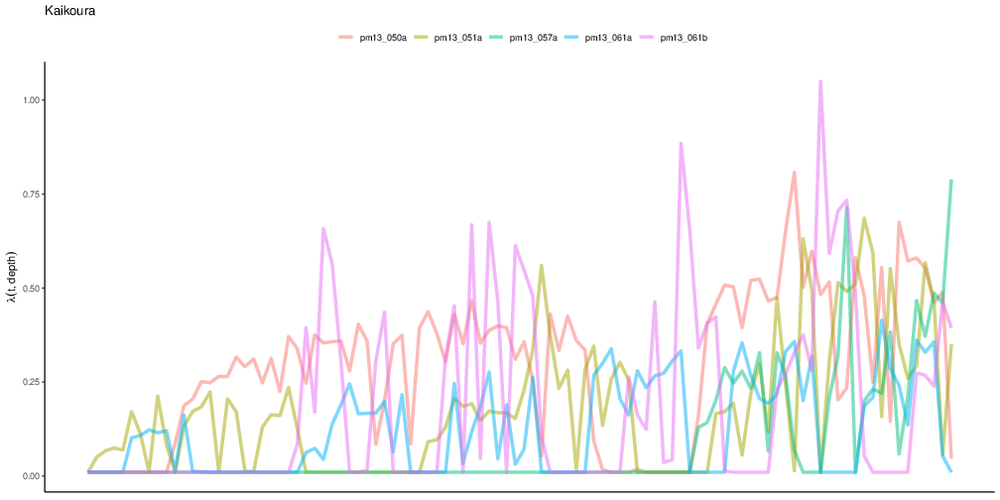
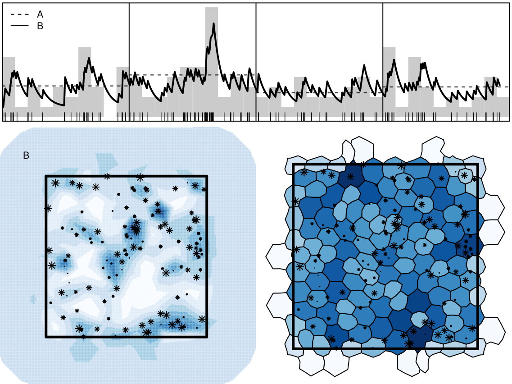

# `r fontawesome::fa(name = "list-check")` `stelfi`

<br>
<br>

`TMB`: `R` package for fitting latent variable models
  - Calculates first and second order derivatives of the likelihood function by AD (or any objective function written in `C++`)
  - User specifies which function arguments the Laplace approximation should be applied to
  
<br>
<br>

`r fontawesome::fa("github")` [github.com/cmjt/stelfi](https://github.com/cmjt/stelfi)

`devtools::install_github("cmjt/stelfi")`

`stelfi::compile_stelfi()`


      
---

# Ftting a spatial LGCP  


 
$$\Lambda(\underline{s}) = \text{exp}(\beta_0 + G(\underline{s}) + \epsilon)$$

  - $\beta_0$, intercept
  - $G(\underline{s})$, Gaussian Markov Random Field (GMRF)
  - $\epsilon$, error 

$G(\underline{s})$ has a Matérn covariance defined by $\tau$ and $\kappa$, where  
  - $r=\frac{\sqrt{8}}{\kappa}$ is the range, and 
  - $\sigma=\frac{1}{\sqrt{4\pi\kappa^2\tau^2}}$ standard deviation

--

`fit <- fit_lgcp(locs, sp, smesh, parameters)`

 - `locs`, matrix of locations
 - `sp`, spatial domain
 - `smesh`, a `INLA::inla.mesh.2d` object
 - `parameters`, vector of parameter starting values

---

# vs. `inlabru`

```{r, eval = TRUE, echo = FALSE, message=FALSE, warning=FALSE}
require(stelfi)
require(maptools)
data(xyt, package = "stelfi")
domain <- as(xyt$window, "SpatialPolygons")
locs <- data.frame(x = xyt$x, y = xyt$y)
smesh <- INLA::inla.mesh.2d(boundary = INLA::inla.sp2segment(domain), 
max.edge = 0.75, cutoff = 0.3)
fit <- fit_lgcp(locs = locs, sp = domain, smesh = smesh, parameters = c(beta = 0, log_tau = log(1), log_kappa = log(1)))
require(inlabru)
matern <- INLA::inla.spde2.matern(smesh)
cmp <- coordinates ~ mySmooth(coordinates, model = matern) + Intercept(1)
coordinates(locs) <- c("x", "y")
fit_inla <- lgcp(cmp, locs, samplers = domain,
                 domain = list(coordinates = smesh),
                 options = list(control.inla = list(int.strategy = "eb")))
```
.pull-left[
<br>
<br>
<br>

```{r, eval = TRUE, echo = FALSE, results='asis'}
df <- data.frame(inlabru = as.numeric(fit_inla$summary.fixed[,1:2]),
                 stelfi = as.numeric(get_coefs(fit)[1, 1:2]))
rownames(df) <- c("Intercept", "SE")
knitr::kable(df, row.names = TRUE, digits = 3) %>%
  kableExtra::kable_styling(latex_options = "striped")
```
]

.pull-right[

```{r, echo=FALSE, eval = TRUE, fig.align='center', warning=FALSE, message=FALSE, out.width="100%"}
p1 <- plot_lambda(fit, smesh = smesh, border = domain) +
    ggplot2::theme_void() + ggplot2::theme(legend.position = "none") + ggtitle("stelfi")
require(ggplot2)
require(patchwork)
lambda <- predict(fit_inla, pixels(smesh), ~ exp(mySmooth + Intercept))
p2 <- ggplot() +
    gg(lambda) +
    gg(domain) +
    coord_fixed() +
    scale_fill_viridis_c() +
    theme_void() + theme(legend.position = "none") + ggtitle("inlabru")
p2 / p1
```
]

---

# Ftting a spatiotemporal LGCP 

<br>
<br>


$$\Lambda(\underline{s}, t) = \text{exp}(\beta_0 + G(\underline{s}, t) + \epsilon)$$
 - $\beta_0$, intercept
  - $G(\underline{s}, t)$, a spatiotemporal GMRF
  - $\epsilon$, error 

--

`fit_lgcp(locs, sp, smesh, tmesh, parameters)`

 - `locs`, matrix of locations
 - `sp`, spatial domain
 - `smesh`, a `INLA::inla.mesh.2d` object
 - `tmesh`,  a `INLA::inla.mesh.1d` object
 - `parameters`, vector of parameter starting values
 

---

# Fitting a marked LGCP

$$\Lambda_{pp}(s) = \text{exp}(\beta_{pp} + G_{pp}(s) + \epsilon_{pp})$$
$$\Lambda_{m_i}(s) = f^{-1}(\beta_{m_i} + G_{m_i}(s) + \alpha\; G_{pp}(s) + \epsilon_{m_i})$$


 - $\alpha$ are coefficient(s) linking the point process and the mark(s). 

 - $\Lambda_{m_i}(s)$ depends on the assumed distribution of the marks e.g.,
    - if Poisson, intensity/rate 
    - if binomial, probability of success (user must supply the number of trials) 
    - if normal, the mean (user must supply the standard deviation)

--

`fit_mlgcp(locs, marks, sp,  smesh, parameters, methods, fields)`

  - `marks`, matrix of marks at each location in `locs`
  - `methods`, integer(s) choice of mark distribution(s)
  - `fields`, binary vector, should a mark specific random field be included
  
---

# `r fontawesome::fa("stopwatch")`

```{r, echo = FALSE, eval = TRUE, out.height="70%", fig.align='center'}
knitr::include_graphics("https://i.pinimg.com/originals/b5/4c/59/b54c59ca34b9bdbbd3c79a2da444dada.jpg")
```

---

# ETAS-type model

<br>
<br>


$$\lambda(t; m(t)) = \mu + \alpha \Sigma_{i:\tau_i<t}m(\tau_i)\text{exp}(-\beta * (t-\tau_i)) $$ 

 - $\mu$, background rate
 - $m(t)$, temporal mark
 - $\Sigma_{i:\tau_i<t} \cdots$, historic dependence 
 
--

`fit_hawkes(times, parameters, marks)`

 - `times`, vector of times
 - `parameters`, starting values of parameters
 - `marks`, (optional) vector of marks
 
---

# `r fontawesome::fa("circle-question")` Which other ISEC talk `r fontawesome::fa("circle-question")`

$$\lambda_j(t; m(t)) = \mu + \alpha \Sigma_{i:\tau_i<t}m(\tau_i)\text{exp}(-\beta_j * (t-\tau_i))$$

$$\text{log}(\beta_j) \sim \text{Normal}(0, \sigma^2)$$

--

<br>
<br>

```{r, echo = FALSE, eval = TRUE, out.width="80%", fig.align='center'}

```


---

# Inhomogeneous Hawkes process 

<br>
<br>

$$\lambda(t) = \mu(t) + \alpha \Sigma_{i:\tau_i<t}\text{exp}(-\beta * (t-\tau_i)) $$ 

- $\mu(t)$, varying background rate

--

`fit_hawkes_cbf(times, parameters, background, background_integral, background_param)`

 - `background`, user supplied $\mu(t)$
 - `background_integral`, integral of `background`
 - `background_param`, starting values of parameters for $\mu(t)$
 
---
 
# `show_hawkes()`

```{r, eval = TRUE, echo = FALSE}
times <- unique(sort(as.numeric(difftime(retweets_niwa ,min(retweets_niwa),units = "mins"))))
params <- c(mu = 9, alpha = 3, beta = 10)
fit <- fit_hawkes(times = times,parameters = params) 
pars <- get_coefs(fit)

```

```{r, eval = TRUE, echo = FALSE, fig.align='center', message = FALSE, warning = FALSE}
show_hawkes(times = times, mu = pars[1,1], alpha = pars[2,1], beta = pars[3,1])
```

---
 
# `show_hawkes_GOF()`

```{r, eval = TRUE, echo = FALSE, fig.align='center', message = FALSE, warning = FALSE, results='hide'}
show_hawkes_GOF(times = times, mu = pars[1,1], alpha = pars[2,1], beta = pars[3,1], return_values = FALSE)
```

---

background-image: url("https://i.pinimg.com/736x/06/2e/73/062e7390f17068792d3547db6a2d2be9--be-patient-under-construction.jpg")


---

# Mesh quality `meshmetrics()`

```{r, echo = FALSE, eval = TRUE, out.width="70%", fig.align='center'}
knitr::include_graphics("https://raw.githubusercontent.com/cmjt/meshmetrics/master/README_files/figure-markdown_strict/triang_properties-1.png")
```


 - radius-edge ratio $= \frac{R}{l_\text{min}}$, where $R$ is the circumradius and $l_\text{min}$ is the length of the shortest edge
 - radius ratio $= \frac{r}{R}$ where $r$ is the inradius.

---

# Mesh quality `meshmetrics()`

```{r, eval = TRUE, echo = FALSE, message = FALSE, warning = FALSE, fig.align='center', out.width="60%"}
require(INLA)
data(horse_mesh, package = "stelfi")
p1 <- plot_mesh(horse_mesh)
p2 <- plot_mesh(horse_mesh, FALSE)
require(patchwork)
p1 / p2
```

---

# Selfexciting spatial models

```{r, echo = FALSE, eval = TRUE, out.width="90%", fig.align='center'}

```


---

# Diolch am wrando 

```{r, eval = FALSE, echo = FALSE}
## linux <sudo apt-get install cowsay>
```

.pull-left[
.animate__animated.animate__bounceInDown[
```{r dragon, echo = FALSE,eval = TRUE, comment = ""}
system2("cowsay", args = "-f dragon 'Questions?'", stdout = TRUE)
```
]
]


.pull-right[
<br>
.center[`r fontawesome::fa("circle-question")`: @TiagoMarques `r emo::ji("whale")` clicks]
<br>
.center[`r fontawesome::fa("twitter")` @cmjonestodd]
<br>
.center[`r fontawesome::fa("github")` [github.com/cmjt/stelfi](https://github.com/cmjt/stelfi)]
<br>
.center[`r fontawesome::fa("image")` [cmjt.github.io/slides/stelfi](https://cmjt.github.io/slides/stelfi)]
]


