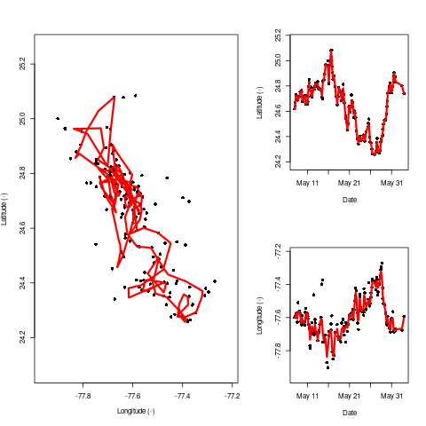
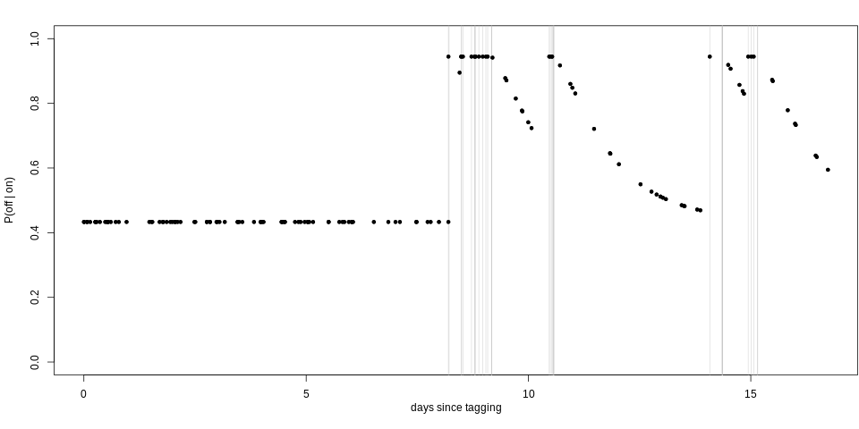
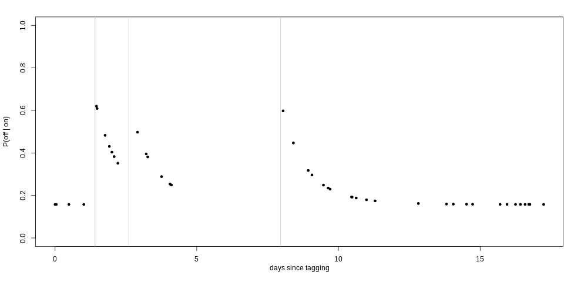

### Vote in Slack: hit `r emo::ji("running")` if you use a running App

--

.center[
```{r run,eval = TRUE, echo = FALSE,out.height=500}
knitr::include_graphics("img/run.png")
```
]


---

.center[
```{r gif,eval = TRUE, echo = FALSE,out.height=600}
knitr::include_graphics("img/whale.gif")
```
]

---

### Continuous-time correlated random walk model (CTCRW) 

For each coordinate $c = 1,2$ of the observed location of an animal at time $t$ ( $t = 1,2,...,n$ ):

<br>

.footnote[Fitted using the **R** package **argosTrack** Albertsen, C. M. (2017). **argosTrack**:  Fit  Movement Models to Argos Data for Marine Animals.  R package version 1.1.0.] 

--
 - instantaneous velocity of the animal $v_{ct}$ is described by a Ornstein-Uhlenbeck process;
 

--
<br>
 - integrating over the velocity process gives the location process $\mu_{ct}$;

--

<br>
 - measurement equation is given by $y_{ct} = \mu_{ct} + \epsilon_{ct}$, where $y_{ct}$ is the $c$th coordinate of the observed location of an animal at time $t$ with measurement error term $\epsilon_{ct}$. The joint distribution of $\epsilon_{1t}$ and $\epsilon_{2t}$ is a bivariate $t$-distribution. 


---

### Continuous-time correlated random walk model (CTCRW) 

.center[
```{r track,eval = TRUE, echo = FALSE,out.height=500}

```
]

.footnote[Fitted using the **R** package **argosTrack** Albertsen, C. M. (2017). **argosTrack**:  Fit  Movement Models to Argos Data for Marine Animals.  R package version 1.1.0.] 

---

### Discrete-space continuous-time

A continuous-time Markov model describes how an individual transitions between states in continuous time.
.center[
```{r markov,echo = FALSE,out.width=600}
par(mar=c(0,0,0,0))
plot(1, type = "n",xlab = "",ylab = "",axes = FALSE, xlim = c(0,1),ylim = c(0,1),asp  = 1)
plotrix::draw.circle(0.25,0.5,0.1)
plotrix::draw.circle(0.75,0.5,0.1)
diagram::curvedarrow(c(0.25,0.4),c(0.75,0.4),curve = 0.1)
diagram::curvedarrow(c(0.75,0.6),c(0.25,0.6),curve = 0.1)
diagram::curvedarrow(c(0.75,0.4),c(0.75,0.6))
diagram::curvedarrow(c(0.25,0.4),c(0.25,0.6),curve = -1)
text(0.25,0.5,"state 1")
text(0.75,0.5,"state 2")
```
]


---

### Discrete-space continuous-time


<br>

Let $q_{rs}(t,z(t))$ represent the immediate risk of moving from one state $r$ to another state $s$:

<br>
$$q_{rs}(t,z(t)) = \text{lim}_{\delta t \rightarrow 0} \mathbb{P}(S(t + \delta t) = s|S(t) = r)/\delta t.$$
<br>

These transition rates form a square matrix $\bf{Q}$ with elements $q_{rs}$.

--

<br>

Here $q_{rr}=-\Sigma_{s{\neq}r}q_{rs}$ (i.e., the rows of **Q** sum to zero and $q_{rs}\geq0$ for $r{\neq}s$).

---

### Discrete-space continuous-time 

<br>

We have $r, s = \{1,2\}$ where state $1=$ off-range (i.e., outside the area used by the Navy for military operations) and state $2=$ on-range:

<br>
<br>

$$\begin{array}{ccc}
  \bf{Q} =
  \left [\begin{array}{cc}
    q_{1 1} & q_{1 2} \\
      q_{2 1} & q_{2 2}
    \end{array}\right ] & \text{where} \: q_{r r} = -q_{r s}, & \text{for}\: r \neq s.
  \end{array}$$

---
  
### Including exposure information


We let 

<br>

$$\text{log}(q_{k, rs}(\mathbf{z}_k(t))) = (\beta_{0,rs} + u_{k, rs}) + \beta_{1,rs}\text{exp}(- \beta_{2,rs} \mathbf{z}_k(t)),$$

where


$$\mathbf{z}_k(t)  \left\{ \begin{array}{rl} = 0 & \text{during exposure} \\ \geq 0 & \text{otherwise}\end{array} \right.$$


is the number of days since an individual was exposed to a sonar event and $\beta_{2,rs} \geq 0$ $\forall\: r \neq s$.

---

### Including exposure information


We let 

<br>

$$\text{log}(q_{k, rs}(\mathbf{z}_k(t))) = (\color{red}{\beta_{0,rs}} + u_{k, rs}) + \beta_{1,rs}\text{exp}(- \beta_{2,rs} \mathbf{z}_k(t)),$$


where


$$\mathbf{z}_k(t)  \left\{ \begin{array}{rl} = 0 & \text{during exposure} \\ \geq 0 & \text{otherwise}\end{array} \right.$$

is the number of days since an individual was exposed to a sonar event and $\beta_{2,rs} \geq 0$ $\forall\: r \neq s$.

<br>

.red[some baseline transition rate]

---

### Including exposure information


We let 

<br>

$$\text{log}(q_{k, rs}(\mathbf{z}_k(t))) = (\beta_{0,rs} + u_{k, rs}) + \color{red}{\beta_{1,rs}}\text{exp}(- \beta_{2,rs} \mathbf{z}_k(t)),$$


where


$$\mathbf{z}_k(t)  \left\{ \begin{array}{rl} = 0 & \text{during exposure} \\ \geq 0 & \text{otherwise}\end{array} \right.$$

is the number of days since an individual was exposed to a sonar event and $\beta_{2,rs} \geq 0$ $\forall\: r \neq s$.

<br>

.red[change in transition rate during exposure]

---

### Including exposure information


We let 

<br>

$$\text{log}(q_{k, rs}(\mathbf{z}_k(t))) = (\beta_{0,rs} + u_{k, rs}) + \beta_{1,rs}\text{exp}(\color{red}{- \beta_{2,rs}} \mathbf{z}_k(t)),$$


where


$$\mathbf{z}_k(t)  \left\{ \begin{array}{rl} = 0 & \text{during exposure} \\ \geq 0 & \text{otherwise}\end{array} \right.$$

is the number of days since an individual was exposed to a sonar event and $\beta_{2,rs} \geq 0$ $\forall\: r \neq s$.

<br>

.red[exponential decay of transition rates towards some baseline]

---

### Including exposure information


We let 

<br>

$$\text{log}(q_{k, rs}(\mathbf{z}_k(t))) = (\beta_{0,rs} + \color{red}{u_{k, rs}}) + \beta_{1,rs}\text{exp}(- \beta_{2,rs} \mathbf{z}_k(t)),$$


where

$$\mathbf{z}_k(t)  \left\{ \begin{array}{rl} = 0 & \text{during exposure} \\ \geq 0 & \text{otherwise}\end{array} \right.$$


is the number of days since an individual was exposed to a sonar event and $\beta_{2,rs} \geq 0$ $\forall\: r \neq s$.

<br>

.red[individual level random effect]


---

### Likelihood


The transition probability matrix $\textbf{P}(t) = \text{Exp}(t\textbf{Q}).$

<br>

The likelihood, $L(\bf{Q})$, is calculated as the product over all individuals and all transitions, of the probabilities that individual $k$ is in state $S(t_{j + 1})$ at time $t_{j+1}$ given they were in state $S(t_j)$ at time $t_j$, evaluated at time $t_{j + 1} - t_j$ (for $j = 1,...,n_k$):

<br>

$$L(\boldsymbol{Q}) = \prod_{k, j} L_{k,j} = \prod_{k, j} p_{S(t_j)S(t_{j + 1})}(t_{j + 1} - t_j).$$

.footnote[Parameter estimates are obtained via minimisation of the negative log-likelihood, log(L(**Q**)), using Template Model Builder (TMB).]

---


.center[
```{r results,eval = TRUE, echo = FALSE,out.height=600,out.width=600}
knitr::include_graphics("img/autec_results.png")
```
]

---

```{r echo = FALSE}
library(xaringanExtra)
xaringanExtra::use_panelset()
```


.panelset[
.panel[.panel-name[93232]
.center[
<br>
<br>
```{r, echo = FALSE,fig.height = 3,out.width = "80%"}
knitr::include_graphics("img/whale1.png")
```
]
]
.panel[.panel-name[11164]
.center[
<br>
<br>
```{r, echo = FALSE,fig.height = 3,out.width = "80%"}

```
]
]
.panel[.panel-name[111670]
.center[
<br>
<br>
```{r, echo = FALSE,fig.height = 3,out.width = "80%"}
knitr::include_graphics("img/whale3.png")
```
]
]
.panel[.panel-name[129715]
.center[
<br>
<br>
```{r, echo = FALSE,fig.height = 3,out.width = "80%"}

```
]
]
.panel[.panel-name[129719]
.center[
<br>
<br>
```{r, echo = FALSE,fig.height = 3,out.width = "80%"}
knitr::include_graphics("img/whale5.png")
```
]
]
.panel[.panel-name[129720]
.center[
<br>
<br>
```{r, echo = FALSE,fig.height = 3,out.width = "80%"}
knitr::include_graphics("img/whale6.png")
```
]
]
.panel[.panel-name[129721]
.center[
<br>
<br>
```{r, echo = FALSE,fig.height = 3,out.width = "80%"}
knitr::include_graphics("img/whale7.png")
```
]
]
]


---

### Diolch am wrando


.pull-left[
.animate__animated.animate__bounceInDown[
```{r hello, echo = FALSE}
## cowsay::say("Any Questions?", by = "shark")
## art <- readLines("whale.txt")
## dput(art)

whale <- c("-------------- ", "Any Questions?", "--------------", "    \\", 
"      \\", "        \\", "\t", "         __ \\ / __", "       /  \\\\ | /  \\\\", 
"           \\\\|/", "       _.---v---.,_", "      /            \\\\  /\\\\__/\\\\", 
"     /              \\\\ \\\\_  _/", "     |__ @           |_/ /", 
"      _/                / ", "      \\\\       \\\\__,     /  ", 
"   ~~~~\\\\~~~~~~~~~~~~~~`~~~[EOC]")

cat(whale,sep = "\n")
```
]
]
.pull-right[

.center[.large[`r icon::fa_twitter(colour = "#00ACEE")` @cmjonestodd]]
<hr>
*Continuous-time discrete-space models of marine mammal exposure
to Navy sonar.* (under review) Jones-Todd, C. M., Pirotta, E.,
Baird, R. W., Durban, J. W., Falcone, E. A., Joyce, T. W., Schorr,
G. S., Watwood, S., & Thomas, L.
<hr>
.center[.card[

[cmjt.github.io/slides/visec2020](https://cmjt.github.io/slides/visec2020)
]
]
]